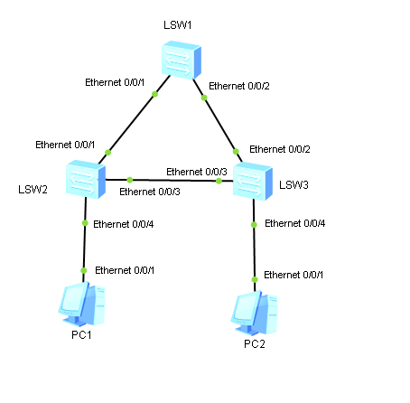

**Внимание!** В готовой топологии для этого задания N принимается равным 2, а не 1, как обычно.

1. Собираем топологию по рисунку:

   

2. Назначаем IP-адреса конечным узлам:

   Узел LeftPC:

   - IP Address: 192.168.1.1
   - Subnet mask: 255.255.255.0

   Узел RightPC:

   - IP Address: 192.168.1.2
   - Subnet mask: 255.255.255.0

3. Делаем линки между коммутаторами транковыми:

   ```
                 [Huawei] sysname TopLSW
                 [TopLSW] interface Ethernet 0/0/1
   [TopLSW-Ethernet0/0/1] port link-type trunk
   [TopLSW-Ethernet0/0/1] interface Ethernet 0/0/2
   [TopLSW-Ethernet0/0/2] port link-type trunk
   ```

   ```
                  [Huawei] sysname LeftLSW
                 [LeftLSW] interface Ethernet 0/0/1
   [LeftLSW-Ethernet0/0/1] port link-type trunk
   [LeftLSW-Ethernet0/0/1] interface Ethernet 0/0/3
   [LeftLSW-Ethernet0/0/3] port link-type trunk
   ```

   ```
                   [Huawei] sysname RightLSW
                 [RightLSW] interface Ethernet 0/0/2
   [RightLSW-Ethernet0/0/2] port link-type trunk
   [RightLSW-Ethernet0/0/2] interface Ethernet 0/0/3
   [RightLSW-Ethernet0/0/3] port link-type trunk
   ```

4. Настраиваем VLAN N на коммутаторах:

   ```
                 [TopLSW] vlan N
                 [TopLSW] interface Ethernet 0/0/1
   [TopLSW-Ethernet0/0/1] port trunk allow-pass vlan N
   [TopLSW-Ethernet0/0/1] interface Ethernet 0/0/2
   [TopLSW-Ethernet0/0/2] port trunk allow-pass vlan N
   ```

   ```
                 [LeftLSW] vlan N
                 [LeftLSW] interface Ethernet 0/0/1
   [LeftLSW-Ethernet0/0/1] port trunk allow-pass vlan N
   [LeftLSW-Ethernet0/0/1] interface Ethernet 0/0/3
   [LeftLSW-Ethernet0/0/3] port trunk allow-pass vlan N
   [LeftLSW-Ethernet0/0/3] interface Ethernet 0/0/4
   [LeftLSW-Ethernet0/0/4] port link-type access
   [LeftLSW-Ethernet0/0/4] port default vlan N
   ```

   ```
                 [RightLSW] vlan N
                 [RightLSW] interface Ethernet 0/0/2
   [RightLSW-Ethernet0/0/2] port trunk allow-pass vlan N
   [RightLSW-Ethernet0/0/2] interface Ethernet 0/0/3
   [RightLSW-Ethernet0/0/3] port trunk allow-pass vlan N
   [RightLSW-Ethernet0/0/3] interface Ethernet 0/0/4
   [RightLSW-Ethernet0/0/4] port link-type access
   [RightLSW-Ethernet0/0/4] port default vlan N
   ```

5. Просматриваем состояние STP на коммутаторах:

   ```
   <TopLSW> display stp
              q
   <TopLSW> display stp brief
   ```

   ```
   <LeftLSW> display stp
                q
   <LeftLSW> display stp brief
   ```

   ```
   <RightLSW> display stp
                 q
   <RightLSW> display stp brief
   ```

   - Корневой коммутатор можно определить по отсутствию у него корневых портов.
   - Коммутатор с наименьшим MAC-адресом стал корневым.

6. Запускаем Wireshark на интерфейсах Ethernet 0/0/1 и Ethernet 0/0/3 LeftLSW и задаём фильтр поиска "icmp".  
   Проверяем связность сети между узлами LeftPC и RightPC:

   ```
   LeftPC> ping 192.168.1.2
   ```

   Wireshark не закрываем.

7. Меняем приоритет коммутатора, который имеет порт в состоянии Alternate (обозначим его **RootLSW**):

   ```
   [RootLSW] stp priority 24576
   ```

8. Проверяем связность сети между узлами LeftPC и RightPC:

   ```
   LeftPC> ping 192.168.1.2
   ```

   - Пакеты теперь следуют по другому маршруту.

9. Ищем порт в состоянии Alternate:

   ```
   <TopLSW> display stp brief
   ```

   ```
   <LeftLSW> display stp brief
   ```

   ```
   <RightLSW> display stp brief
   ```

   Меняем приоритет коммутатора, который имеет порт в состоянии Alternate (обозначим его **BackupLSW**):

   ```
   [BackupLSW] stp priority 28672
   ```

10. Проверяем связность сети между узлами LeftPC и RightPC:

    ```
    LeftPC> ping 192.168.1.2
    ```

    - Маршрут следования пакетов не изменился.

11. Соединяем коммутаторы RootLSW и BackupLSW ещё одним линком.

12. Проверяем состояние портов коммутаторов RootLSW и BackupLSW, к которым присоединён новый линк:

    ```
    <RootLSW> display stp brief
    ```

    ```
    <BackupLSW> display stp brief
    ```

    Меняем приоритет порта коммутатора RootLSW, к которому присоединён новый линк (обозначим его **Ethernet 0/0/B**):

    ```
                  [RootLSW] interface Ethernet 0/0/B
    [RootLSW-Ethernet0/0/B] stp port priority 112
    ```

    Проверяем, что роли портов коммутатора BackupLSW поменялись местами:

    ```
    <BackupLSW> display stp brief
    ```

13. Удаляем линк, добавленный в пункте 11.

14. Отменяем изменения приоритетов коммутаторов:

    ```
    [BackupLSW] undo stp priority
    ```

    ```
    [RootLSW] undo stp priority
    ```

15. Присоединяем к LeftLSW новый конечный узел NewLeftPC и назначаем ему IP-адрес:

    - IP Address: 192.168.1.3
    - Subnet mask: 255.255.255.0

    Присоединяем к RightLSW новый конечный узел NewRightPC и назначаем ему IP-адрес:

   - IP Address: 192.168.1.4
   - Subnet mask: 255.255.255.0

16. Проверяем связность сети между узлами NewLeftPC и NewRightPC:

    ```
    NewLeftPC> ping 192.168.1.4
    ```

17. Запускаем отдельный STP-процесс для VLAN N:

    ```
               [TopLSW] stp region-configuration
    [TopLSW-mst-region] region-name default
    [TopLSW-mst-region] instance N vlan N
    [TopLSW-mst-region] active region-configuration
    ```

    ```
               [LeftLSW] stp region-configuration
    [LeftLSW-mst-region] region-name default
    [LeftLSW-mst-region] instance N vlan N
    [LeftLSW-mst-region] active region-configuration
    ```

    ```
               [RightLSW] stp region-configuration
    [RightLSW-mst-region] region-name default
    [RightLSW-mst-region] instance N vlan N
    [RightLSW-mst-region] active region-configuration
    ```

    Делаем корневые коммутаторы для каждого из экземпляров STP разными:

    ```
    [TopLSW] stp instance 0 root primary
    ```

    ```
    [LeftLSW] stp instance N root primary
    ```

    Проверяем маршруты следования пакетов от LeftPC до RightPC и от NewLeftPC до NewRightPC:

    ```
    LeftPC> ping 192.168.1.2
    ```

    ```
    NewLeftPC> ping 192.168.1.4
    ```

    Закрываем Wireshark.

18. Просматриваем состояние STP на коммутаторах:

    ```
    <TopLSW> display stp
               q
    ```

    ```
    <LeftLSW> display stp
                 q
    ```

    ```
    <RightLSW> display stp
                  q
    ```

    - В строке Port Cost видим, что для расчёта стоимости маршрута используется стандарт IEEE 802.1T.

    Меняем стандарт для расчёта стоимости маршрута на IEEE 802.1D:

    ```
    [TopLSW] stp pathcost-standard dot1d-1998
    ```

    ```
    [LeftLSW] stp pathcost-standard dot1d-1998
    ```

    ```
    [RightLSW] stp pathcost-standard dot1d-1998
    ```
