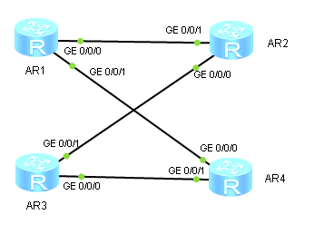

1. Меняем топологию согласно рисунку:

   
   
   - Передвигаем маршрутизаторы AR3 и AR4
   - Соединяем маршрутизаторы AR1 и AR4 линком

2. Назначаем IP-адреса новым интерфейсам маршрутизаторов AR1 и AR4:

   ```
                        [AR1] interface  GigabitEthernet 0/0/1
   [AR1-GigabitEthernet0/0/1] ip address 192.168.N.14 30
   ```

   ```
                        [AR4] interface  GigabitEthernet 0/0/0
   [AR4-GigabitEthernet0/0/0] ip address 192.168.N.13 30
   ```

3. Настраиваем специфические статические маршруты на AR2, AR3 и AR4:

   ```
   [AR2] ip route-static 192.168.N.12 30 192.168.N.1
   ```

   ```
   [AR3] ip route-static 192.168.N.12 30 192.168.N.10
   [AR3] undo ip route-static 192.168.N.0 30
   [AR3] ip route-static 192.168.N.0 30 192.168.N.10
   ```

   ```
   [AR4] ip route-static 192.168.N.0 30 192.168.N.14
   ```

4. Выполняем трассировку маршрутов с AR1 до AR3 и с AR3 до AR1:

   ```
   <AR1> tracert 192.168.N.6
   <AR1> tracert 192.168.N.9
   ```

   ```
   <AR3> tracert 192.168.N.1
   <AR3> tracert 192.168.N.14
   ```

5. Отменяем маршруты, настроенные в пункте 3:

   ```
   [AR2] undo ip route-static 192.168.N.12 30
   ```

   ```
   [AR3] undo ip route-static 192.168.N.12 30
   [AR3] undo ip route-static 192.168.N.0 30
   ```

   ```
   [AR4] undo ip route-static 192.168.N.0 30
   ```

6. Настраиваем маршруты по умолчанию на AR2, AR3 и AR4:

   ```
   [AR2] ip route-static 0.0.0.0 0 192.168.N.6
   ```

   ```
   [AR3] ip route-static 0.0.0.0 0 192.168.N.10
   ```

   ```
   [AR4] undo ip route-static 0.0.0.0 0
   [AR4] ip route-static 0.0.0.0 0 192.168.N.14
   ```

7. Включаем захват пакетов на интерфейсе GE 0/0/0 маршрутизатора AR1.

8. Проверяем доступность IP-адреса 8.8.8.8 с AR1:

   ```
   <AR1> ping -c 1 8.8.8.8
   ```

9. В Wireshark задаём фильтр поиска "icmp". Должна быть видна последовательность ICMP-пакетов.

   - Отправленный ICMP-пакет «зациклился».
   - Причина в том, что статическая настройка маршрутизации между маршрутизаторами образует цикл. Т. к. ICMP-пакет не может найти своего получателя, то он будет пересылаться по кругу.
   - В последовательности захваченных пакетов TTL каждого следующего уменьшается на 4 — количество маршрутизаторов в цикле.
   - Пересылка ICMP-пакета по кругу завершится, когда его TTL станет равным 0.
