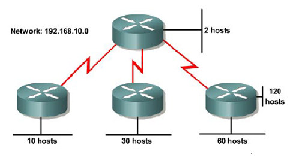

1. Сеть 192.168.N.0/24 разделяется на следующие подсети:

   - 192.168.N.0   /30 (для 1 Serial линка)
   - 192.168.N.4   /30 (для 2 Serial линка)
   - 192.168.N.8   /30 (для 3 Serial линка)
   - 192.168.N.12  /30 (для 2 хостов)
   - 192.168.N.16  /28 (для 10 хостов)
   - 192.168.N.32  /27 (для 30 хостов)
   - 192.168.N.64  /26 (для 60 хостов)
   - 192.168.N.128 /25 (для 120 хостов)
   
   На самом деле вместе с хостами нужно также посчитать ещё и интерфейс маршрутизатора (т. е. в каждой подсети нужно считать на один адрес больше). Например, в подсети 192.168.N.12 будут не только два хоста, но ещё и маршрутизатор, поэтому адресов для неё нужно 3, а не 2, соответственно, маска должна быть 29 вместо 30.
   
   Но тогда в первоначальной сети не хватит адресов на все подсети. Видимо, Максютин здесь промахнулся и то ли неверно посчитал, то ли забыл учесть это, поэтому аккуратно забиваем на это.

2. Собираем топологию по рисунку:

   

3. Эмулируем периферийные сети с помощью петлевых адаптеров и присваиваем IP-адреса интерфейсам маршрутизаторов:

   ```
           [Huawei] sysname R0
               [R0] interface  LoopBack 0
     [R0-LoopBack0] ip address 192.168.N.13 30
     [R0-LoopBack0] interface  Serial 0/0/1
   [R0-Serial0/0/1] ip address 192.168.N.1 30
   [R0-Serial0/0/1] interface  Serial 0/0/2
   [R0-Serial0/0/2] ip address 192.168.N.5 30
   [R0-Serial0/0/2] interface  Serial 0/0/3
   [R0-Serial0/0/3] ip address 192.168.N.9 30
   ```

   ```
           [Huawei] sysname R1
               [R1] interface  LoopBack 0
     [R1-LoopBack0] ip address 192.168.N.17 28
     [R1-LoopBack0] interface  Serial 0/0/0
   [R1-Serial0/0/0] ip address 192.168.N.2 30
   ```

   ```
           [Huawei] sysname R2
               [R2] interface  LoopBack 0
     [R2-LoopBack0] ip address 192.168.N.33 27
     [R2-LoopBack0] interface  Serial 0/0/0
   [R2-Serial0/0/0] ip address 192.168.N.6 30
   ```

   ```
           [Huawei] sysname R3
               [R3] interface  LoopBack 0
     [R3-LoopBack0] ip address 192.168.N.65 26
     [R3-LoopBack0] interface  LoopBack 1
     [R3-LoopBack1] ip address 192.168.N.129 25
     [R3-LoopBack1] interface  Serial 0/0/0
   [R3-Serial0/0/0] ip address 192.168.N.10 30
   ```

4. Настраиваем статическую маршрутизацию на маршрутизаторах:

   ```
   [R0] ip route-static 192.168.N.16 28 192.168.N.2
   [R0] ip route-static 192.168.N.32 27 192.168.N.6
   [R0] ip route-static 192.168.N.64 26 192.168.N.10
   [R0] ip route-static 192.168.N.128 25 192.168.N.10
   ```

   ```
   [R1] ip route-static 0.0.0.0 0 192.168.N.1
   ```

   ```
   [R2] ip route-static 0.0.0.0 0 192.168.N.5
   ```

   ```
   [R3] ip route-static 0.0.0.0 0 192.168.N.9
   ```

   Проверяем связность сети:
   
   ```
   <R0> ping 192.168.N.17
   <R0> ping 192.168.N.33
   <R0> ping 192.168.N.65
   <R0> ping 192.168.N.129
   ```
   
   ```
   <R1> ping 192.168.N.13
   <R1> ping 192.168.N.33
   <R1> ping 192.168.N.65
   <R1> ping 192.168.N.129
   ```
   
   ```
   <R2> ping 192.168.N.13
   <R2> ping 192.168.N.17
   <R2> ping 192.168.N.65
   <R2> ping 192.168.N.129
   ```
   
   ```
   <R3> ping 192.168.N.13
   <R3> ping 192.168.N.17
   <R3> ping 192.168.N.33
   ```
