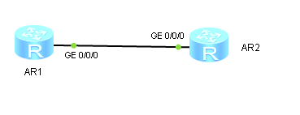

1. Собираем топологию по рисунку:

   

2. Назначаем IP-адреса интерфейсам маршрутизаторов:

   ```
                        [Huawei] sysname LeftAR
                        [LeftAR] interface  GigabitEthernet 0/0/0
   [LeftAR-GigabitEthernet0/0/0] ip address 10.N.0.1 30
   ```

   ```
                         [Huawei] sysname RightAR
                        [RightAR] interface  GigabitEthernet 0/0/0
   [RightAR-GigabitEthernet0/0/0] ip address 10.N.0.2 30
   ```

3. Проверяем связность сети между маршрутизаторами:

   ```
   <LeftAR> ping 10.N.0.2
   ```

4. Создаём петлевые интерфейсы на маршрутизаторе LeftAR и назначаем им IP-адреса:

   ```
             [LeftAR] interface  LoopBack 1
   [LeftAR-LoopBack1] ip address 20.N.1.1 24
   [LeftAR-LoopBack1] interface  LoopBack 2
   [LeftAR-LoopBack2] ip address 20.N.2.1 24
   [LeftAR-LoopBack2] interface  LoopBack 3
   [LeftAR-LoopBack3] ip address 20.N.3.1 24
   ```

5. Создаём петлевые интерфейсы на маршрутизаторе LeftAR и назначаем им IP-адреса:

   ```
             [RightAR] interface  LoopBack 1
   [RightAR-LoopBack1] ip address 30.N.1.1 24
   [RightAR-LoopBack1] interface  LoopBack 2
   [RightAR-LoopBack2] ip address 30.N.2.1 24
   [RightAR-LoopBack2] interface  LoopBack 3
   [RightAR-LoopBack3] ip address 30.N.3.1 24
   ```

6. Проверяем, что у каждого из маршрутизаторов LeftAR и RightAR в таблице маршрутизации есть маршруты до всех сетей, в которых располагаются интерфейсы этого маршрутизатора:

   ```
   <LeftAR> display ip routing-table
   ```

   ```
   <RightAR> display ip routing-table
   ```

7. Настраиваем RIPv2-маршрутизацию на LeftAR:

   ```
         [LeftAR] rip 1
   [LeftAR-rip-1] version 2
   [LeftAR-rip-1] undo summary
   [LeftAR-rip-1] network 10.0.0.0
   [LeftAR-rip-1] network 20.0.0.0
   ```

8. Настраиваем RIPv2-маршрутизацию на RightAR:

   ```
         [RightAR] rip 1
   [RightAR-rip-1] version 2
   [RightAR-rip-1] undo summary
   [RightAR-rip-1] network 10.0.0.0
   [RightAR-rip-1] network 30.0.0.0
   ```

9. Проверяем, что в таблицах маршрутизации LeftAR и RightAR есть маршруты до всех сетей:

   ```
   <LeftAR> display ip routing-table
   <LeftAR> display ip routing-table | include RIP
   <LeftAR> display ip routing-table protocol rip
   ```

   ```
   <RightAR> display ip routing-table
   <RightAR> display ip routing-table | include RIP
   <RightAR> display ip routing-table protocol rip
   ```

10. Просматриваем информацию о RIP-процессе 1 на маршрутизаторе LeftAR:

    ```
    <LeftAR> display rip 1 database
    ```

11. Запускаем Wireshark на интерфейсе GE 0/0/0 LeftAR и задаём фильтр поиска "rip".

    - RIP-пакеты рассылаются на групповые IP-адрес 224.0.0.9 и MAC-адрес 01-00-5E-00-00-09.
    - Каждый маршрутизатор анонсирует только сети, в которых находятся его петлевые интерфейсы, причём каждая сеть анонсируется отдельно.

    Wireshark не закрываем.

12. Включаем автосуммирование маршрутов на RightAR:

    ```
          [RightAR] rip 1
    [RightAR-rip-1] summary
    ```

13. Просматриваем содержимое RIP-пакетов, рассылаемых RightAR.

    - Ничего не изменилось.

14. Включаем безусловное автосуммирование маршрутов на RightAR:

    ```
          [RightAR] rip 1
    [RightAR-rip-1] summary always
    ```

15. Просматриваем содержимое RIP-пакетов, рассылаемых RightAR.

    - Метрика сетей 30.N.1.0/24, 30.N.2.0/24, 30.N.3.0/24 изменилась с 1 до 16, то есть они теперь считаются недоступными.
    - Добавилась сеть 30.0.0.0/8 с метрикой 1.

    Просматриваем таблицу маршрутизации LeftAR:

    ```
    <LeftAR> display ip routing-table
    ```

    - Вместо маршрутов до сетей 30.N.1.0/24, 30.N.2.0/24, 30.N.3.0/24 появился маршрут до сети 30.0.0.0/8, при этом метрика осталась той же, равной 1.

16. Включаем обычное автосуммирование вместо безусловного на RightAR:

    ```
          [RightAR] rip 1
    [RightAR-rip-1] summary
    ```

17. Отключаем разделение горизонта на интерфейсе GE 0/0/0 RightAR:

    ```
                         [RightAR] interface GigabitEthernet 0/0/0
    [RightAR-GigabitEthernet0/0/0] undo rip split-horizon
    ```

18. Просматриваем содержимое RIP-пакетов, рассылаемых RightAR.

    - Добавилась сеть 20.0.0.0/8 с метрикой 2.

    Просматриваем таблицу маршрутизации LeftAR:

    ```
    <LeftAR> display ip routing-table
    ```

    - Добавился маршрут до сети 20.0.0.0/8 с метрикой 2, при этом маршруты до сетей 20.N.1.0/24, 20.N.2.0/24, 20.N.3.0/24 остались.

    Wireshark можно закрыть.

19. Маршруты до сетей 30.N.1.0/24, 30.N.2.0/24, 30.N.3.0/24 не остаются в таблице маршрутизации LeftAR после выполнения суммирования маршрутов до истечения таймера Timeout, потому что добавляется маршрут с точно такими же параметрами до сети 30.0.0.0/8, которая содержит в себе все три сети. (Но это неточно)

20. Отключаем отправку RIP-объявлений на интерфейсе GE 0/0/0 RightAR:

    ```
                         [RightAR] interface GigabitEthernet 0/0/0
    [RightAR-GigabitEthernet0/0/0] undo rip output
    ```

21. Через 3 минуты просматриваем информацию о RIP-маршрутах на LeftAR:

    ```
    <LeftAR> display ip routing-table protocol rip
    <LeftAR> display rip 1 database
    ```

22. Через 2 минуты просматриваем информацию о RIP-маршрутах на LeftAR:

    ```
    <LeftAR> display ip routing-table protocol rip
    <LeftAR> display rip 1 database
    ```

23. Различия в информации о RIP-маршрутах на LeftAR после отключения отправки RIP-объявлений на RightAR:

    - Через 3 минуты из таблицы маршрутизации исчезли RIP-маршруты, а в базе данных метрика RIP-маршрутов, полученных от RightAR, изменилась на 16 (то есть они стали отмечены как недоступные).
    - Через 2 минуты из базы данных полностью исчезли RIP-маршруты, полученные от RightAR.
