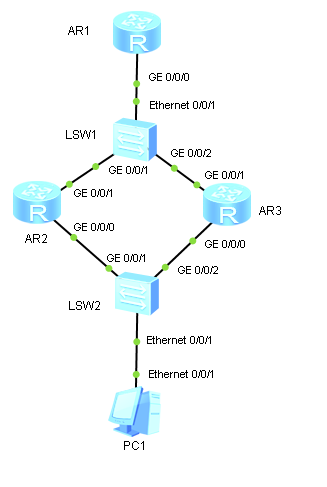

**Внимание!** В этой лабе может встретиться баг с поведением VRRP, когда оба маршрутизатора имеют роль Master для одной и той же VRRP-группы. Можно попробовать вылечить перезагрузкой тех портов, которые должны иметь роль Backup (команды `shutdown` и `undo shutdown` в port-view).

1. Собираем топологию по рисунку:

   

2. Назначаем IP-адреса интерфейсам маршрутизаторов:

   ```
                       [Huawei] sysname TopAR
                        [TopAR] interface GigabitEthernet 0/0/0
   [TopAR-GigabitEthernet0/0/0] ip address 10.0.N.10 24
   ```

   ```
                        [Huawei] sysname LeftAR
                        [LeftAR] interface GigabitEthernet 0/0/0
   [LeftAR-GigabitEthernet0/0/0] ip address 192.168.N.2 24
   [LeftAR-GigabitEthernet0/0/0] interface GigabitEthernet 0/0/1
   [LeftAR-GigabitEthernet0/0/1] ip address 10.0.N.2 24
   ```

   ```
                         [Huawei] sysname RightAR
                        [RightAR] interface GigabitEthernet 0/0/0
   [RightAR-GigabitEthernet0/0/0] ip address 192.168.N.3 24
   [RightAR-GigabitEthernet0/0/0] interface GigabitEthernet 0/0/1
   [RightAR-GigabitEthernet0/0/1] ip address 10.0.N.3 24
   ```

3. Назначаем IP-адрес узлу PC:

   - IP Address: 192.168.N.10
   - Subnet mask: 255.255.255.0
   - Gateway: 192.168.N.1

4. На TopAR настраиваем статический маршрут:

   ```
   [TopAR] ip route-static 192.168.N.0 24 10.0.N.1
   ```

5. Проверяем связность внутри сетей:

   ```
   <LeftAR> ping 10.0.N.10
   <LeftAR> ping 10.0.N.3
   <LeftAR> ping 192.168.N.10
   <LeftAR> ping 192.168.N.3
   ```

   Проверяем отсутствие связности между сетями:

   ```
   <TopAR> ping 192.168.N.2
   <TopAR> ping 192.168.N.10
   ```

6. На LeftAR настраиваем VRRP-группу 1 и присваиваем ей IP-адрес:

   ```
                        [LeftAR] interface GigabitEthernet 0/0/0
   [LeftAR-GigabitEthernet0/0/0] vrrp vrid 1 virtual-ip 192.168.N.1
   ```

7. Просматриваем состояние VRRP-группы:

   ```
   <LeftAR> display vrrp
   ```

   - Роль: Master  
     Так как LeftAR — единственный маршрутизатор в VRRP-группе
   - Приоритет: 100
   - Виртуальный IP-адрес: 192.168.N.1

8. На RightAR настраиваем VRRP-группу 1 и присваиваем ей IP-адрес:

   ```
                        [RightAR] interface GigabitEthernet 0/0/0
   [RightAR-GigabitEthernet0/0/0] vrrp vrid 1 virtual-ip 192.168.N.1
   ```

9. Просматриваем состояние VRRP-группы:

   ```
   <RightAR> display vrrp
   ```

   - Роль: Backup  
     Так как LeftAR уже является Master
   - Приоритет: 100
   - Виртуальный IP-адрес: 192.168.N.1

10. Выполняем ping с узла PC (должен быть успешным):

    ```
    PC> ping 192.168.N.1
    PC> ping 10.0.N.2
    PC> ping 10.0.N.3
    ```

    Просматриваем ARP-кэш узла PC:

    ```
    PC> arp -a
    ```

    - В кэше есть запись IP-адреса VRRP-группы (192.168.N.1) с виртуальным MAC-адресом  
      MAC-адрес VRRP-группы начинается на 00-00-5E-00-01, как определено в [RFC 5798](https://tools.ietf.org/html/rfc5798).
    - В кэше нет записей физических IP-адресов маршрутизаторов (10.0.N.2 и 10.0.N.3)  
      Так как узел PC посылает пакеты не в свою сеть, а в 10.0.N.0/24, то он посылает их шлюзу по умолчанию, то есть на IP-адрес 192.168.N.1, предварительно сделав ARP-запрос для разрешения этого адреса. После этого пакеты идут в шлюз по умолчанию; таким образом, узел PC не делает ARP-запросов для разрешения IP-адресов 10.0.N.2 и 10.0.N.3 и не узнаёт соответствующие MAC-адреса.

11. На LeftAR и RightAR настраиваем VRRP-группу 2 и присваиваем ей IP-адрес:

    ```
                         [RightAR] interface GigabitEthernet 0/0/1
    [RightAR-GigabitEthernet0/0/1] vrrp vrid 2 virtual-ip 10.0.N.1
    ```

    ```
                         [LeftAR] interface GigabitEthernet 0/0/1
    [LeftAR-GigabitEthernet0/0/1] vrrp vrid 2 virtual-ip 10.0.N.1
    ```

12. Просматриваем состояние VRRP-группы:

    ```
    <LeftAR> display vrrp
    ```

    - Роль: Backup  
      Так как RightAR был первым включён в VRRP-группу 2
    - Приоритет: 100
    - Виртуальный IP-адрес: 10.0.N.1

    ```
    <RightAR> display vrrp
    ```

    - Роль: Master  
    - Приоритет: 100
    - Виртуальный IP-адрес: 10.0.N.1

13. Проверяем прохождение пакетов от PC до TopAR:

    ```
    PC> ping 10.0.N.10
    ```

14. Выполняем трассировку пакетов от PC до TopAR:

    ```
    PC> tracert 10.0.N.10
    ```

    Пакеты идут через маршрутизатор с ролью Master, в нашем случае через LeftAR.

15. Выключаем интерфейс GE 0/0/1 маршрутизатора LeftAR:

    ```
                         [LeftAR] interface GigabitEthernet 0/0/1
    [LeftAR-GigabitEthernet0/0/1] shutdown
    ```

16. Просматриваем состояние VRRP-группы:

    ```
    <LeftAR> display vrrp
    ```

    ```
    <RightAR> display vrrp
    ```

    Проверяем отсутствие прохождения пакетов от PC до TopAR:

    ```
    PC> ping 10.0.N.10
    ```

    Выполняем трассировку пакетов от PC до TopAR:

    ```
    PC> tracert 10.0.N.10
    ```

    Пакеты от PC до TopAR идут через LeftAR, так как он является Master в VRRP-группе 1, и пропадают, потому что LeftAR не может переслать пакеты из-за отключённого порта.

17. Настраиваем динамическую маршрутизацию через RIP на маршрутизаторах:

    ```
          [TopAR] rip 1
    [TopAR-rip-1] version 2
    [TopAR-rip-1] network 10.0.0.0
    ```

    ```
          [LeftAR] rip 1
    [LeftAR-rip-1] version 2
    [LeftAR-rip-1] network 10.0.0.0
    [LeftAR-rip-1] network 192.168.N.0
    ```

    ```
          [RightAR] rip 1
    [RightAR-rip-1] version 2
    [RightAR-rip-1] network 10.0.0.0
    [RightAR-rip-1] network 192.168.N.0
    ```

18. Просматриваем IP-адреса и состояние VRRP-группы на маршрутизаторе LeftAR:

    ```
    <LeftAR> display ip interface brief
    <LeftAR> display vrrp brief
    ```

    Проверяем прохождение пакетов от PC до TopAR:

    ```
    PC> ping 10.0.N.10
    ```

    Выполняем трассировку пакетов от PC до TopAR:

    ```
    PC> tracert 10.0.N.10
    ```

19. Изменяем приоритет RightAR на 150 для VRRP-группы 1:

    ```
                         [RightAR] interface GigabitEthernet 0/0/0
    [RightAR-GigabitEthernet0/0/0] vrrp vrid 1 priority 150
    ```

    Теперь приоритет RightAR выше, чем LeftAR, поэтому:

    - LeftAR сменил свою роль с Master на Backup.
    - RightAR сменил свою роль с Backup на Master.

20. Изменяем приоритет RightAR на 50 для VRRP-группы 1:

    ```
                         [RightAR] interface GigabitEthernet 0/0/0
    [RightAR-GigabitEthernet0/0/0] vrrp vrid 1 priority 50
    ```

    Теперь приоритет LeftAR выше, чем RightAR, поэтому:

    - LeftAR сменил свою роль с Backup на Master.
    - RightAR сменил свою роль с Master на Backup.

21. Выключаем preempt-режим и изменяем приоритет RightAR на 150 для VRRP-группы 1:

    ```
                         [RightAR] interface GigabitEthernet 0/0/0
    [RightAR-GigabitEthernet0/0/0] vrrp vrid 1 preempt-mode disable
    [RightAR-GigabitEthernet0/0/0] vrrp vrid 1 priority 150
    ```

    Теперь приоритет RightAR выше, чем LeftAR, но у RightAR выключен preempt-режим, поэтому он не пытается забрать себе роль Master до тех пор, пока текущий маршрутизатор с ролью Master не станет недоступным.
