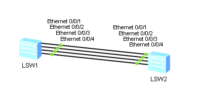

**Внимание!** В готовой топологии для этого задания N принимается равным 2, а не 1, как обычно.

1. Собираем топологию по рисунку:

   

2. Просматриваем состояние STP:

   ```
   <LeftLSW> display stp brief
   ```

   ```
   <RightLSW> display stp brief
   ```

   - На одном коммутаторе (корневом) все порты назначенные, на другом — Ethernet 0/0/1 корневой, остальные заблокированные.

3. Засматриваемся на непонятную картинку от Максютина:

   

4. Читаем о различиях типов агрегации линков Manual и LACP (можно и не читать, но только тссс):

   

5. Создаём LAG 1 на коммутаторах и настраиваем Manual EtherChannel:

   ```
               [Huawei] sysname LeftLSW
              [LeftLSW] interface Eth-Trunk 1
   [LeftLSW-Eth-Trunk1] trunkport Ethernet 0/0/1
   [LeftLSW-Eth-Trunk1] trunkport Ethernet 0/0/2
   ```

   ```
                [Huawei] sysname RightLSW
              [RightLSW] interface Eth-Trunk 1
   [RightLSW-Eth-Trunk1] trunkport Ethernet 0/0/1
   [RightLSW-Eth-Trunk1] trunkport Ethernet 0/0/2
   ```

6. Просматриваем состояние LAG 1 на коммутаторах:

   ```
   <LeftLSW> display eth-trunk
   <LeftLSW> display interface Eth-Trunk 1
   ```

   ```
   <RightLSW> display eth-trunk
   <RightLSW> display interface Eth-Trunk 1
   ```

7. Создаём LAG N на коммутаторах и настраиваем LACP:

   ```
              [LeftLSW] interface Eth-Trunk N
   [LeftLSW-Eth-TrunkN] mode lacp-static
   [LeftLSW-Eth-TrunkN] trunkport Ethernet 0/0/3
   [LeftLSW-Eth-TrunkN] trunkport Ethernet 0/0/4
   ```

   ```
              [RightLSW] interface Eth-Trunk N
   [RightLSW-Eth-TrunkN] mode lacp-static
   [RightLSW-Eth-TrunkN] trunkport Ethernet 0/0/3
   [RightLSW-Eth-TrunkN] trunkport Ethernet 0/0/4
   ```

8. Просматриваем состояние LAG N на коммутаторах:

   ```
   <LeftLSW> display interface Eth-Trunk N
   ```

   ```
   <RightLSW> display interface Eth-Trunk N
   ```

9. Просматриваем состояние STP на некорневом коммутаторе (обозначим его **BackupLSW**):

   ```
   <BackupLSW> display stp brief
   ```

   - LAG 1 — корневой порт, LAG N — заблокированный, так как LAG 1 имеет меньший номер.

10. Удаляем LAG 1 на коммутаторе LeftLSW:

    ```
               [LeftLSW] interface Eth-Trunk 1
    [LeftLSW-Eth-Trunk1] undo trunkport Ethernet 0/0/1
    [LeftLSW-Eth-Trunk1] undo trunkport Ethernet 0/0/2
    [LeftLSW-Eth-Trunk1] quit
               [LeftLSW] undo interface Eth-Trunk 1
    ```

11. Удаляем LAG 1 на коммутаторе RightLSW:

    ```
               [RightLSW] interface Eth-Trunk 1
    [RightLSW-Eth-Trunk1] undo trunkport Ethernet 0/0/1
    [RightLSW-Eth-Trunk1] undo trunkport Ethernet 0/0/2
    [RightLSW-Eth-Trunk1] quit
               [RightLSW] undo interface Eth-Trunk 1
    ```

12. Просматриваем состояние STP на коммутаторе BackupLSW:

    ```
    <BackupLSW> display stp brief
    ```

    - LAG N — корневой порт, остальные заблокированные.

13. Настраиваем ограничение на количество активных линков в LAG N на коммутаторах:

    ```
               [LeftLSW] interface Eth-Trunk N
    [LeftLSW-Eth-TrunkN] max active-linknumber 3
    ```

    ```
               [RightLSW] interface Eth-Trunk N
    [RightLSW-Eth-TrunkN] max active-linknumber 3
    ```

14. Добавляем интерфейс Ethernet 0/0/1 к LAG N на коммутаторах:

    ```
                  [LeftLSW] interface Ethernet 0/0/1
    [LeftLSW-Ethernet0/0/1] Eth-Trunk N
    ```

    ```
                  [RightLSW] interface Ethernet 0/0/1
    [RightLSW-Ethernet0/0/1] Eth-Trunk N
    ```

15. Просматриваем состояние LAG N на коммутаторах:

    ```
    <LeftLSW> display interface Eth-Trunk N
    ```

    ```
    <RightLSW> display interface Eth-Trunk N
    ```

    - В LAG 3 активных линка.

    Просматриваем состояние STP для LAG N на коммутаторах:

    ```
    <LeftLSW> display stp interface Eth-Trunk N
               
    ```

    ```
    <RightLSW> display stp interface Eth-Trunk N
                
    ```

    - LAG имеет Path Cost, равный 66665 (в 3 раза меньше Path Cost обычного линка).

16. Добавляем интерфейс Ethernet 0/0/2 к LAG N на коммутаторах:

    ```
                  [LeftLSW] interface Ethernet 0/0/2
    [LeftLSW-Ethernet0/0/2] Eth-Trunk N
    ```

    ```
                  [RightLSW] interface Ethernet 0/0/2
    [RightLSW-Ethernet0/0/2] Eth-Trunk N
    ```

    Просматриваем состояние LAG N на коммутаторах:

    ```
    <LeftLSW> display interface Eth-Trunk N
    ```

    ```
    <RightLSW> display interface Eth-Trunk N
    ```

    - Линк Ethernet 0/0/2 не стал активным, так как достигнуто максимальное количество активных линков.

17. Выключаем интерфейс Ethernet 0/0/1 LeftLSW:

    ```
                  [LeftLSW] interface Ethernet 0/0/1
    [LeftLSW-Ethernet0/0/1] shutdown
    ```

18. Просматриваем состояние LAG N на коммутаторах:

    ```
    <LeftLSW> display interface Eth-Trunk N
    ```

    ```
    <RightLSW> display interface Eth-Trunk N
    ```

    - Линк Ethernet 0/0/2 стал активным.

19. Запускаем Wireshark на интерфейсе Ethernet 0/0/2 LeftLSW и задаём фильтр поиска "lacp".

    - В пакетах использована инкапсуляция (в порядке от внешнего к внутреннему): Ethernet II, LACP.
