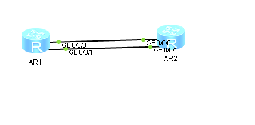

1. Собираем топологию по рисунку:

   

2. Создаём LAG 0 на маршрутизаторе LeftAR:

   ```
   [Huawei] sysname LeftAR
   [LeftAR] interface Eth-Trunk 0
   ```

3. Переключаем LAG 0 в L3-режим:

   ```
              [LeftAR] interface Eth-Trunk 0
   [LeftAR-Eth-Trunk0] undo portswitch
   ```

4. Настраиваем LACP на LAG 0 и добавляем к нему интерфейсы GE 0/0/0 и GE 0/0/1:

   ```
              [LeftAR] interface Eth-Trunk 0
   [LeftAR-Eth-Trunk0] mode lacp-static
   [LeftAR-Eth-Trunk0] trunkport GigabitEthernet 0/0/0
   [LeftAR-Eth-Trunk0] trunkport GigabitEthernet 0/0/1
   ```

5. Создаём и настраиваем LAG 0 на маршрутизаторе RightAR:

   ```
               [Huawei] sysname RightAR
              [RightAR] interface Eth-Trunk 0
   [RightAR-Eth-Trunk0] undo portswitch
   [RightAR-Eth-Trunk0] mode lacp-static
   [RightAR-Eth-Trunk0] trunkport GigabitEthernet 0/0/0
   [RightAR-Eth-Trunk0] trunkport GigabitEthernet 0/0/1
   ```

6. Назначаем IP-адреса интерфейсам маршрутизаторов на концах LAG 0:

   ```
              [LeftAR] interface  Eth-Trunk 0
   [LeftAR-Eth-Trunk0] ip address 192.168.0.5 30
   ```

   ```
              [RightAR] interface  Eth-Trunk 0
   [RightAR-Eth-Trunk0] ip address 192.168.0.6 30
   ```

7. Запускаем Wireshark на интерфейсах GE 0/0/0 и GE 0/0/1 LeftAR и проверяем связность сети между маршрутизаторами:

   ```
   <LeftAR> ping 192.168.0.6
   ```

8. Просматриваем передаваемые пакеты.

   - ICMP-пакеты передаются только по GE 0/0/0.
   - LACP-пакеты передаются по обоим линкам.
