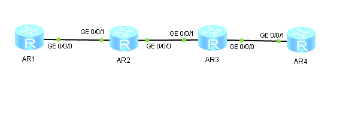

1. Собираем топологию по рисунку:

   

2. Назначаем IP-адреса интерфейсам маршрутизаторов:

   ```
                     [Huawei] sysname AR1
                        [AR1] interface  GigabitEthernet 0/0/0
   [AR1-GigabitEthernet0/0/0] ip address 192.168.N.1 30
   ```

   ```
                     [Huawei] sysname AR2
                        [AR2] interface  GigabitEthernet 0/0/1
   [AR2-GigabitEthernet0/0/1] ip address 192.168.N.2 30
   [AR2-GigabitEthernet0/0/1] interface  GigabitEthernet 0/0/0
   [AR2-GigabitEthernet0/0/0] ip address 192.168.N.5 30
   ```

   ```
                     [Huawei] sysname AR3
                        [AR3] interface  GigabitEthernet 0/0/1
   [AR3-GigabitEthernet0/0/1] ip address 192.168.N.6 30
   [AR3-GigabitEthernet0/0/1] interface  GigabitEthernet 0/0/0
   [AR3-GigabitEthernet0/0/0] ip address 192.168.N.9 30
   ```

   ```
                     [Huawei] sysname AR4
                        [AR4] interface  GigabitEthernet 0/0/1
   [AR4-GigabitEthernet0/0/1] ip address 192.168.N.10 30
   ```

3. Задаём маршруты по умолчанию на AR1 и AR4:

   ```
   [AR1] ip route-static 0.0.0.0 0 192.168.N.2
   ```

   ```
   [AR4] ip route-static 0.0.0.0 0 192.168.N.9
   ```

4. Настраиваем специфические статические маршруты на AR2 и AR3 до неприсоединённых сетей:

   ```
   [AR2] ip route-static 192.168.N.8 30 192.168.N.6
   ```

   ```
   [AR3] ip route-static 192.168.N.0 30 192.168.N.5
   ```

5. Проверяем доступность остальных маршрутизаторов с AR1:

   ```
   <AR1> ping 192.168.N.2
   <AR1> ping 192.168.N.5
   <AR1> ping 192.168.N.6
   <AR1> ping 192.168.N.9
   <AR1> ping 192.168.N.10
   ```

6. Выполняем просмотр маршрутных таблиц на маршрутизаторах AR1–AR4:

   ```
   <AR1> display ip routing-table
   ```

   ```
   <AR2> display ip routing-table
   ```

   ```
   <AR3> display ip routing-table
   ```

   ```
   <AR4> display ip routing-table
   ```

7. Выполняем трассировку маршрута с AR1 до AR4:

   ```
   <AR1> tracert 192.168.N.10
   ```
