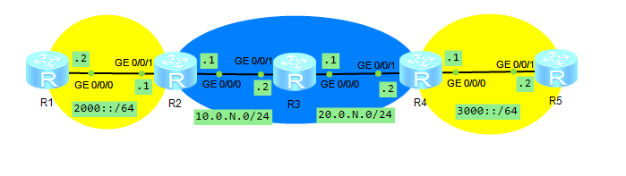

**Внимание!** В используемой в этом решении топологии расположение интерфейсов отличается от расположения на рисунке от Максютина.

1. Собираем топологию по рисунку:

   

   - Интерфейсы маршрутизаторов направляем следующим образом:
     - GE 0/0/0 RightAR к MiddleAR
     - GE 0/0/1 RightAR к RightBottomAR
     - GE 0/0/0 RightBottomAR к RightAR
     - GE 0/0/1 RightBottomAR не используем

2. Назначаем IPv4-адреса интерфейсам маршрутизаторов LeftAR, MiddleAR и RightAR в IPv4-сетях:

   ```
                        [Huawei] sysname LeftAR
                        [LeftAR] interface  GigabitEthernet 0/0/0
   [LeftAR-GigabitEthernet0/0/0] ip address 10.0.N.1 24
   ```

   ```
                          [Huawei] sysname MiddleAR
                        [MiddleAR] interface  GigabitEthernet 0/0/0
   [MiddleAR-GigabitEthernet0/0/0] ip address 10.0.N.2 24
   [MiddleAR-GigabitEthernet0/0/0] interface  GigabitEthernet 0/0/1
   [MiddleAR-GigabitEthernet0/0/1] ip address 20.0.N.1 24
   ```

   ```
                         [Huawei] sysname RightAR
                        [RightAR] interface  GigabitEthernet 0/0/0
   [RightAR-GigabitEthernet0/0/0] ip address 20.0.N.2 30
   ```

   Настраиваем RIPv2-маршрутизацию:

   ```
         [LeftAR] rip 1
   [LeftAR-rip-1] version 2
   [LeftAR-rip-1] network 10.0.0.0
   ```

   ```
         [MiddleAR] rip 1
   [MiddleAR-rip-1] version 2
   [MiddleAR-rip-1] network 10.0.0.0
   [MiddleAR-rip-1] network 20.0.0.0
   ```

   ```
         [RightAR] rip 1
   [RightAR-rip-1] version 2
   [RightAR-rip-1] network 20.0.0.0
   ```

   Проверяем связность сети между LeftAR и RightAR:

   ```
   <LeftAR> ping 20.0.N.2
   ```

3. Назначаем IPv6-адреса интерфейсам маршрутизаторов LeftAR, LeftBottomAR, RightAR и RightBottomAR в IPv6-сетях:

   ```
                        [LeftAR] ipv6
                        [LeftAR] interface GigabitEthernet 0/0/1
   [LeftAR-GigabitEthernet0/0/1] ipv6 enable
   [LeftAR-GigabitEthernet0/0/1] ipv6 address 2000::1/64
   ```

   ```
                              [Huawei] sysname LeftBottomAR
                        [LeftBottomAR] ipv6
                        [LeftBottomAR] interface GigabitEthernet 0/0/0
   [LeftBottomAR-GigabitEthernet0/0/0] ipv6 enable
   [LeftBottomAR-GigabitEthernet0/0/0] ipv6 address 2000::2/64
   ```

   ```
                        [RightAR] ipv6
                        [RightAR] interface GigabitEthernet 0/0/1
   [RightAR-GigabitEthernet0/0/1] ipv6 enable
   [RightAR-GigabitEthernet0/0/1] ipv6 address 3000::1/64
   ```

   ```
                               [Huawei] sysname RightBottomAR
                        [RightBottomAR] ipv6
                        [RightBottomAR] interface GigabitEthernet 0/0/0
   [RightBottomAR-GigabitEthernet0/0/0] ipv6 enable
   [RightBottomAR-GigabitEthernet0/0/0] ipv6 address 3000::2/64
   ```

   Проверяем связность сети между LeftAR и LeftBottomAR:

   ```
   <LeftAR> ping ipv6 2000::2
   ```

   Проверяем связность сети между RightAR и RightBottomAR:

   ```
   <RightAR> ping ipv6 3000::2
   ```

4. Настраиваем туннель IPv6 через IPv4 на маршрутизаторах LeftAR и RightAR:

   ```
               [LeftAR] interface Tunnel 0/0/0
   [LeftAR-Tunnel0/0/0] ipv6 enable
   [LeftAR-Tunnel0/0/0] ipv6 address 2500::1/64
   [LeftAR-Tunnel0/0/0] tunnel-protocol ipv6-ipv4
   [LeftAR-Tunnel0/0/0] source 10.0.N.1
   [LeftAR-Tunnel0/0/0] destination 20.0.N.2
   ```

   ```
               [RightAR] interface Tunnel 0/0/0
   [RightAR-Tunnel0/0/0] ipv6 enable
   [RightAR-Tunnel0/0/0] ipv6 address 2500::2/64
   [RightAR-Tunnel0/0/0] tunnel-protocol ipv6-ipv4
   [RightAR-Tunnel0/0/0] source 20.0.N.2
   [RightAR-Tunnel0/0/0] destination 10.0.N.1
   ```

5. Настраиваем RIPng-маршрутизацию на LeftAR, LeftBottomAR, RightAR и RightBottomAR:

   ```
                        [LeftAR] interface GigabitEthernet 0/0/1
   [LeftAR-GigabitEthernet0/0/1] ripng 1 enable
   [LeftAR-GigabitEthernet0/0/1] interface Tunnel 0/0/0
            [LeftAR-Tunnel0/0/0] ripng 1 enable
   ```

   ```
                        [LeftBottomAR] interface GigabitEthernet 0/0/0
   [LeftBottomAR-GigabitEthernet0/0/0] ripng 1 enable
   ```

   ```
                        [RightAR] interface GigabitEthernet 0/0/1
   [RightAR-GigabitEthernet0/0/1] ripng 1 enable
   [RightAR-GigabitEthernet0/0/1] interface Tunnel 0/0/0
            [RightAR-Tunnel0/0/0] ripng 1 enable
   ```

   ```
                        [RightBottomAR] interface GigabitEthernet 0/0/0
   [RightBottomAR-GigabitEthernet0/0/0] ripng 1 enable
   ```

   Выполняем трассировку маршрута с LeftBottomAR до RightBottomAR:

   ```
   <LeftBottomAR> tracert ipv6 3000::2
   ```

   - В трассировке видим 3 хопа:
     1. 2000::1 (GE 0/0/1 LeftAR)
     2. 2500::2 (Tunnel 0/0/0 RightAR)
     3. 3000::2 (GE 0/0/0 RightBottomAR)

6. Запускаем Wireshark на интерфейсе GE 0/0/0 LeftAR и задаём фильтр "ripng".

   - В пакетах использована инкапсуляция (в порядке от внешнего к внутреннему): Ethernet II, IPv4, IPv6, UDP, RIPng.
