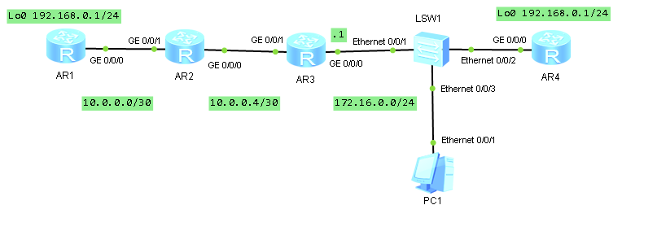

1. Собираем топологию по рисунку:

   

2. Назначаем IPv4-адреса интерфейсам маршрутизаторов:

   ```
                     [Huawei] sysname AR1
                        [AR1] interface  GigabitEthernet 0/0/0
   [AR1-GigabitEthernet0/0/0] ip address 10.0.0.1 30
   [AR1-GigabitEthernet0/0/0] interface  LoopBack 0
              [AR1-LoopBack0] ip address 192.168.0.1 24
   ```

   ```
                     [Huawei] sysname AR2
                        [AR2] interface  GigabitEthernet 0/0/0
   [AR2-GigabitEthernet0/0/0] ip address 10.0.0.5 30
   [AR2-GigabitEthernet0/0/0] interface  GigabitEthernet 0/0/1
   [AR2-GigabitEthernet0/0/1] ip address 10.0.0.2 30
   ```

   ```
                        [Huawei] sysname DhcpAR
                        [DhcpAR] interface  GigabitEthernet 0/0/0
   [DhcpAR-GigabitEthernet0/0/0] ip address 172.16.0.1 24
   [DhcpAR-GigabitEthernet0/0/0] interface  GigabitEthernet 0/0/1
   [DhcpAR-GigabitEthernet0/0/1] ip address 10.0.0.6 30
   ```

   ```
                       [Huawei] sysname BadAR
                        [BadAR] dhcp enable
                        [BadAR] interface  GigabitEthernet 0/0/0
   [BadAR-GigabitEthernet0/0/0] ip address dhcp-alloc
   [BadAR-GigabitEthernet0/0/0] interface  LoopBack 0
              [BadAR-LoopBack0] ip address 192.168.0.1 24
   ```

   На DhcpAR настраиваем DHCP-сервер для раздачи IP-адресов в сеть 172.16.0.0/24:

   ```
                        [DhcpAR] dhcp enable
                        [DhcpAR] ip pool default
        [DhcpAR-ip-pool-default] network 172.16.0.0 mask 24
        [DhcpAR-ip-pool-default] gateway-list 172.16.0.1
        [DhcpAR-ip-pool-default] interface GigabitEthernet 0/0/0
   [DhcpAR-GigabitEthernet0/0/0] dhcp select global
   ```

   На узле PC указываем настройку IPv4 Configuration: DHCP.

3. Настраиваем RIPv2-маршрутизацию на AR1, AR2 и DhcpAR:

   ```
         [AR1] rip 1
   [AR1-rip-1] version 2
   [AR1-rip-1] network 10.0.0.0
   [AR1-rip-1] network 192.168.0.0
   ```

   ```
         [AR2] rip 1
   [AR2-rip-1] version 2
   [AR2-rip-1] network 10.0.0.0
   ```

   ```
         [DhcpAR] rip 1
   [DhcpAR-rip-1] version 2
   [DhcpAR-rip-1] network 10.0.0.0
   [DhcpAR-rip-1] network 172.16.0.0
   ```

   Проверяем доступность IP-адреса 192.168.0.1 с узла PC:

   ```
   PC> ping 192.168.0.1
   ```

   Выполняем трассировку маршрута с узла PC до IP-адреса 192.168.0.1:

   ```
   PC> tracert 192.168.0.1
   ```

   - В трассировке видим три хопа:
     1. 172.16.0.1 (GE 0/0/0 DhcpAR)
     2. 10.0.0.5 (GE 0/0/0 AR2)
     3. 192.168.0.1 (LoopBack 0 AR1)

4. Настраиваем на BadAR RIPv2-маршрутизацию:

   ```
         [BadAR] rip 1
   [BadAR-rip-1] version 2
   [BadAR-rip-1] network 172.16.0.0
   [BadAR-rip-1] network 192.168.0.0
   ```

5. Проверяем, что маршрут с узла PC до IP-адреса 192.168.0.1 изменился:

   ```
   PC> tracert 192.168.0.1
   ```

   - В трассировке видим два хопа:
     1. 172.16.0.1 (GE 0/0/0 DhcpAR)
     2. 192.168.0.1 (LoopBack 0 BadAR)

6. На интерфейсе GE 0/0/0 DhcpAR отменяем приём и отправку RIP-пакетов:

   ```
                        [DhcpAR] interface GigabitEthernet 0/0/0
   [DhcpAR-GigabitEthernet0/0/0] undo rip input
   [DhcpAR-GigabitEthernet0/0/0] undo rip output
   ```

   Проверяем, что маршрут с узла PC до IP-адреса 192.168.0.1 изменился на первоначальный:

   ```
   PC> tracert 192.168.0.1
   ```

   - В трассировке видим три хопа: DhcpAR, AR2, AR1.

7. На интерфейсе GE 0/0/0 DhcpAR включаем приём и отправку RIP-пакетов:

   ```
                        [DhcpAR] interface GigabitEthernet 0/0/0
   [DhcpAR-GigabitEthernet0/0/0] rip input
   [DhcpAR-GigabitEthernet0/0/0] rip output
   ```

   Проверяем, что маршрут с узла PC до IP-адреса 192.168.0.1 снова стал неправильным:

   ```
   PC> tracert 192.168.0.1
   ```

   - В трассировке видим два хопа: DhcpAR, BadAR.

8. Настраиваем простую аутентификацию для RIP на маршрутизаторе DhcpAR:

   ```
                        [DhcpAR] interface GigabitEthernet 0/0/0
   [DhcpAR-GigabitEthernet0/0/0] rip authentication-mode simple plain password
   ```

9. Проверяем, что маршрут с узла PC до IP-адреса 192.168.0.1 изменился на первоначальный:

   ```
   PC> tracert 192.168.0.1
   ```

   - В трассировке видим три хопа: DhcpAR, AR2, AR1.

10. Запускаем Wireshark на интерфейсе GE 0/0/0 DhcpAR, задаём фильтр поиска "rip" и просматриваем содержимое пакетов, рассылаемых DhcpAR.

    - Маршрутная информация передаётся в нешифрованном виде.
    - Пароль передаётся в открытом виде.

11. Меняем тип аутентификации для RIP на защищённый MD5:

    ```
                         [DhcpAR] interface GigabitEthernet 0/0/0
    [DhcpAR-GigabitEthernet0/0/0] rip authentication-mode md5 usual password
    ```

12. Просматриваем содержимое RIP-пакетов, рассылаемых DhcpAR.

    - Содержимое пакетов зашифровано, поэтому их нельзя просмотреть.

13. Проверяем, что маршрут с узла PC до IP-адреса 192.168.0.1 остался первоначальным:

   ```
   PC> tracert 192.168.0.1
   ```

   - В трассировке видим три хопа: DhcpAR, AR2, AR1.
