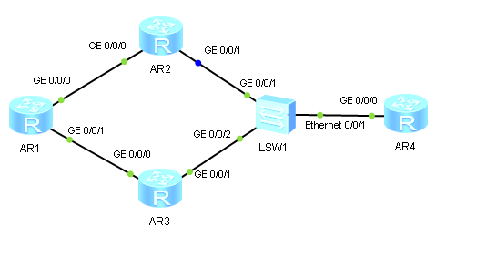

1. Собираем топологию по рисунку:

   

2. Назначаем IPv6-адреса интерфейсам маршрутизаторов:

   ```
                        [Huawei] sysname LeftAR
                        [LeftAR] ipv6
                        [LeftAR] interface GigabitEthernet 0/0/0
   [LeftAR-GigabitEthernet0/0/0] ipv6 enable
   [LeftAR-GigabitEthernet0/0/0] ipv6 address 2001:N::1/64
   [LeftAR-GigabitEthernet0/0/0] interface GigabitEthernet 0/0/1
   [LeftAR-GigabitEthernet0/0/1] ipv6 enable
   [LeftAR-GigabitEthernet0/0/1] ipv6 address 2002:N::1/64
   [LeftAR-GigabitEthernet0/0/1] interface LoopBack 0
              [LeftAR-LoopBack0] ipv6 enable
              [LeftAR-LoopBack0] ipv6 address 3000:N::1/64
   ```

   ```
                       [Huawei] sysname TopAR
                        [TopAR] ipv6
                        [TopAR] interface GigabitEthernet 0/0/0
   [TopAR-GigabitEthernet0/0/0] ipv6 enable
   [TopAR-GigabitEthernet0/0/0] ipv6 address 2001:N::2/64
   [TopAR-GigabitEthernet0/0/0] interface GigabitEthernet 0/0/1
   [TopAR-GigabitEthernet0/0/1] ipv6 enable
   [TopAR-GigabitEthernet0/0/1] ipv6 address 2003:N::2/64
   [TopAR-GigabitEthernet0/0/1] undo ipv6 nd ra halt
   ```

   ```
                          [Huawei] sysname BottomAR
                        [BottomAR] ipv6
                        [BottomAR] interface GigabitEthernet 0/0/0
   [BottomAR-GigabitEthernet0/0/0] ipv6 enable
   [BottomAR-GigabitEthernet0/0/0] ipv6 address 2002:N::2/64
   [BottomAR-GigabitEthernet0/0/0] interface GigabitEthernet 0/0/1
   [BottomAR-GigabitEthernet0/0/1] ipv6 enable
   [BottomAR-GigabitEthernet0/0/1] ipv6 address 2003:N::3/64
   [BottomAR-GigabitEthernet0/0/1] undo ipv6 nd ra halt
   ```

3. Настраиваем RIPng-маршрутизацию между маршрутизаторами:

   ```
                        [LeftAR] ripng 1
                [LeftAR-ripng-1] interface GigabitEthernet 0/0/0
   [LeftAR-GigabitEthernet0/0/0] ripng 1 enable
   [LeftAR-GigabitEthernet0/0/0] interface GigabitEthernet 0/0/1
   [LeftAR-GigabitEthernet0/0/1] ripng 1 enable
   [LeftAR-GigabitEthernet0/0/1] interface LoopBack 0
              [LeftAR-LoopBack0] ripng 1 enable
   ```

   ```
                        [TopAR] ripng 1
                [TopAR-ripng-1] interface GigabitEthernet 0/0/0
   [TopAR-GigabitEthernet0/0/0] ripng 1 enable
   [TopAR-GigabitEthernet0/0/0] interface GigabitEthernet 0/0/1
   [TopAR-GigabitEthernet0/0/1] ripng 1 enable
   ```

   ```
                        [BottomAR] ripng 1
                [BottomAR-ripng-1] interface GigabitEthernet 0/0/0
   [BottomAR-GigabitEthernet0/0/0] ripng 1 enable
   [BottomAR-GigabitEthernet0/0/0] interface GigabitEthernet 0/0/1
   [BottomAR-GigabitEthernet0/0/1] ripng 1 enable
   ```

4. Настраиваем VRRP на маршрутизаторах TopAR и BottomAR:

   ```
                        [TopAR] interface GigabitEthernet 0/0/1
   [TopAR-GigabitEthernet0/0/1] vrrp6 vrid 1 virtual-ip fe80::1 link-local
   ```

   ```
                        [BottomAR] interface GigabitEthernet 0/0/1
   [BottomAR-GigabitEthernet0/0/1] vrrp6 vrid 1 virtual-ip fe80::1 link-local
   ```

5. Просматриваем состояние VRRP-группы:

   ```
   <TopAR> display vrrp6
   ```

   ```
   <BottomAR> display vrrp6
   ```

   TopAR имеет роль Master.

6. Запускаем Wireshark на интерфейсе Ethernet 0/0/1 LSW, задаём фильтр поиска "icmpv6" и просматриваем перехваченные пакеты с Router Advertisement (если RA долго не приходят, можно перезагрузить интерфейс GE 0/0/1 TopAR):

   - Объявляемый префикс: 2003:N::/64  
     В RA должен объявляться префикс, используемый в данной подсети.
   - Адрес отправителя: fe80::1  
     Такой адрес назначен VRRP-группе.

   Wireshark не закрываем, понадобится в 8-м пункте.

7. Назначаем VRRP-группе IPv6-адрес (после этого роль Master, скорее всего, перейдёт к BottomAR):

   ```
                        [TopAR] interface GigabitEthernet 0/0/1
   [TopAR-GigabitEthernet0/0/1] vrrp6 vrid 1 virtual-ip 2003:N::1
   ```

   ```
                        [BottomAR] interface GigabitEthernet 0/0/1
   [BottomAR-GigabitEthernet0/0/1] vrrp6 vrid 1 virtual-ip 2003:N::1
   ```

8. В Wireshark просматриваем перехваченные пакеты с Router Advertisement:

   - Объявляемый префикс: 2003:N::/64  
   - Адрес отправителя: fe80::1  
     Согласно [RFC 4861](https://tools.ietf.org/html/rfc4861#page-19), адрес отправителя RA должен быть link-local.

   Wireshark закрываем.

9. Назначаем IPv6-адрес маршрутизатору RightAR:

   ```
                         [Huawei] sysname RightAR
                        [RightAR] ipv6
                        [RightAR] interface GigabitEthernet 0/0/0
   [RightAR-GigabitEthernet0/0/0] ipv6 enable
   [RightAR-GigabitEthernet0/0/0] ipv6 address 2003:N::10/64
   [RightAR-GigabitEthernet0/0/0] ipv6 route-static :: 0 2003:N::1
   ```

10. Запускаем Wireshark на интерфейсах GE 0/0/1 TopAR и GE 0/0/1 BottomAR, задаём фильтр поиска "udp" и выполняем трассировку маршрута от RightAR до петлевого интерфейса LeftAR:

    ```
    <RightAR> tracert ipv6 3000:N::1
    ```

    Просматриваем перехватываемые UDP-пакеты: они следуют через маршрутизатор BottomAR, имеющий роль Master в VRRP-группе.

    Wireshark не закрываем, понадобится в 12-м пункте.

11. Отключаем интерфейс GE 0/0/1 BottomAR:

    ```
                         [BottomAR] interface GigabitEthernet 0/0/1
    [BottomAR-GigabitEthernet0/0/1] shutdown
    ```

12. Выполняем трассировку маршрута от RightAR до петлевого интерфейса LeftAR и просматриваем перехватываемые UDP-пакеты в Wireshark:

    ```
    <RightAR> tracert ipv6 3000:N::1
    ```

    Пакеты следуют через маршрутизатор TopAR.
