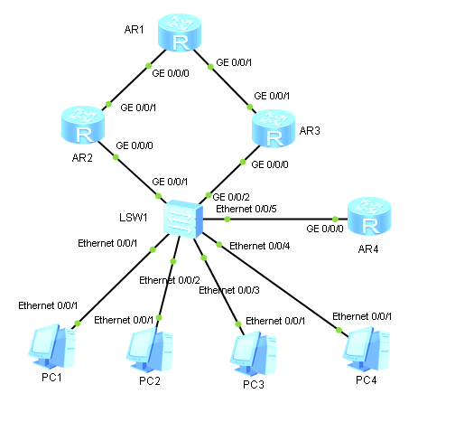

1. Собираем топологию по рисунку:

   

2. На коммутаторе создаём VLAN 10 и 20:

   ```
   [Huawei] sysname LSW
      [LSW] vlan batch 10 20
   ```

3. Добавляем узлы PC1 и PC2 в VLAN 10, узлы PC3 и PC4 — в VLAN 20.

   ```
                 [LSW] interface Ethernet 0/0/1
   [LSW-Ethernet0/0/1] port link-type access
   [LSW-Ethernet0/0/1] port default vlan 10
   [LSW-Ethernet0/0/1] interface Ethernet 0/0/2
   [LSW-Ethernet0/0/2] port link-type access
   [LSW-Ethernet0/0/2] port default vlan 10
   [LSW-Ethernet0/0/2] interface Ethernet 0/0/3
   [LSW-Ethernet0/0/3] port link-type access
   [LSW-Ethernet0/0/3] port default vlan 20
   [LSW-Ethernet0/0/3] interface Ethernet 0/0/4
   [LSW-Ethernet0/0/4] port link-type access
   [LSW-Ethernet0/0/4] port default vlan 20
   ```

4. Настраиваем интерфейсы коммутатора GE 0/0/1, GE 0/0/2, Ethernet 0/0/5 как транковые и разрешаем прохождение по ним VLAN 10 и 20:

   ```
                        [LSW] interface Ethernet 0/0/5
          [LSW-Ethernet0/0/5] port link-type trunk
          [LSW-Ethernet0/0/5] port trunk allow-pass vlan 10 20
          [LSW-Ethernet0/0/5] interface GigabitEthernet 0/0/1
   [LSW-GigabitEthernet0/0/1] port link-type trunk
   [LSW-GigabitEthernet0/0/1] port trunk allow-pass vlan 10 20
   [LSW-GigabitEthernet0/0/1] interface GigabitEthernet 0/0/2
   [LSW-GigabitEthernet0/0/2] port link-type trunk
   [LSW-GigabitEthernet0/0/2] port trunk allow-pass vlan 10 20
   ```

5. На маршрутизаторе DhcpAR создаём и настраиваем сабинтерфейсы для VLAN 10 и 20:

   ```
                           [Huawei] sysname DhcpAR
                           [DhcpAR] vlan batch 10 20
                           [DhcpAR] interface GigabitEthernet 0/0/0.10
   [DhcpAR-GigabitEthernet0/0/0.10] dot1q termination vid 10
   [DhcpAR-GigabitEthernet0/0/0.10] ip address 192.168.N.126 25
   [DhcpAR-GigabitEthernet0/0/0.10] interface GigabitEthernet 0/0/0.20
   [DhcpAR-GigabitEthernet0/0/0.20] dot1q termination vid 20
   [DhcpAR-GigabitEthernet0/0/0.20] ip address 192.168.N.254 25
   ```

6. На маршрутизаторе DhcpAR настраиваем раздачу сетевых настроек в VLAN 10 и 20 через DHCP:

   ```
                           [DhcpAR] dhcp enable
                           [DhcpAR] ip pool vlan10
            [DhcpAR-ip-pool-vlan10] network 192.168.N.0 mask 25
            [DhcpAR-ip-pool-vlan10] gateway-list 192.168.N.1
            [DhcpAR-ip-pool-vlan10] excluded-ip-address 192.168.N.2
            [DhcpAR-ip-pool-vlan10] excluded-ip-address 192.168.N.126
            [DhcpAR-ip-pool-vlan10] interface GigabitEthernet 0/0/0.10
   [DhcpAR-GigabitEthernet0/0/0.10] dhcp select global
   [DhcpAR-GigabitEthernet0/0/0.10] ip pool vlan20
            [DhcpAR-ip-pool-vlan20] network 192.168.N.128 mask 25
            [DhcpAR-ip-pool-vlan20] gateway-list 192.168.N.129
            [DhcpAR-ip-pool-vlan20] excluded-ip-address 192.168.N.130
            [DhcpAR-ip-pool-vlan20] excluded-ip-address 192.168.N.254
            [DhcpAR-ip-pool-vlan20] interface GigabitEthernet 0/0/0.20
   [DhcpAR-GigabitEthernet0/0/0.20] dhcp select global
   ```

7. На интерфейсах GE 0/0/0 маршрутизаторов LeftAR и RightAR создаём и терминируем сабинтерфейсы для VLAN 10 и 20:

   ```
                           [Huawei] sysname LeftAR
                           [LeftAR] vlan batch 10 20
                           [LeftAR] interface GigabitEthernet 0/0/0.10
   [LeftAR-GigabitEthernet0/0/0.10] dot1q termination vid 10
   [LeftAR-GigabitEthernet0/0/0.10] interface GigabitEthernet 0/0/0.20
   [LeftAR-GigabitEthernet0/0/0.20] dot1q termination vid 20
   ```

   ```
                            [Huawei] sysname RightAR
                           [RightAR] vlan batch 10 20
                           [RightAR] interface GigabitEthernet 0/0/0.10
   [RightAR-GigabitEthernet0/0/0.10] dot1q termination vid 10
   [RightAR-GigabitEthernet0/0/0.10] interface GigabitEthernet 0/0/0.20
   [RightAR-GigabitEthernet0/0/0.20] dot1q termination vid 20
   ```

8. Назначаем IP-адреса сабинтерфейсам маршрутизаторов LeftAR и RightAR:

   ```
                           [LeftAR] interface GigabitEthernet 0/0/0.10
   [LeftAR-GigabitEthernet0/0/0.10] ip address 192.168.N.1 25
   [LeftAR-GigabitEthernet0/0/0.10] arp broadcast enable
   [LeftAR-GigabitEthernet0/0/0.10] interface GigabitEthernet 0/0/0.20
   [LeftAR-GigabitEthernet0/0/0.20] ip address 192.168.N.130 25
   [LeftAR-GigabitEthernet0/0/0.20] arp broadcast enable
   ```

   ```
                           [RightAR] interface GigabitEthernet 0/0/0.10
   [RightAR-GigabitEthernet0/0/0.10] ip address 192.168.N.2 25
   [RightAR-GigabitEthernet0/0/0.10] arp broadcast enable
   [RightAR-GigabitEthernet0/0/0.10] interface GigabitEthernet 0/0/0.20
   [RightAR-GigabitEthernet0/0/0.20] ip address 192.168.N.129 25
   [RightAR-GigabitEthernet0/0/0.20] arp broadcast enable
   ```

9. Создаём VRRP-группы 1 и 2 на сабинтерфейсах маршрутизаторов LeftAR и RightAR:

   ```
                           [LeftAR] interface GigabitEthernet 0/0/0.10
   [LeftAR-GigabitEthernet0/0/0.10] vrrp vrid 1 virtual-ip 192.168.N.1
   [LeftAR-GigabitEthernet0/0/0.10] interface GigabitEthernet 0/0/0.20
   [LeftAR-GigabitEthernet0/0/0.20] vrrp vrid 2 virtual-ip 192.168.N.129
   ```

   ```
                           [RightAR] interface GigabitEthernet 0/0/0.10
   [RightAR-GigabitEthernet0/0/0.10] vrrp vrid 1 virtual-ip 192.168.N.1
   [RightAR-GigabitEthernet0/0/0.10] interface GigabitEthernet 0/0/0.20
   [RightAR-GigabitEthernet0/0/0.20] vrrp vrid 2 virtual-ip 192.168.N.129
   ```

10. Назначаем IP-адреса оставшимся интерфейсам маршрутизаторов:

    ```
                        [Huawei] sysname TopAR
                         [TopAR] interface GigabitEthernet 0/0/0
    [TopAR-GigabitEthernet0/0/0] ip address 10.0.N.1 30
    [TopAR-GigabitEthernet0/0/0] interface GigabitEthernet 0/0/1
    [TopAR-GigabitEthernet0/0/1] ip address 10.0.N.5 30
    [TopAR-GigabitEthernet0/0/1] interface LoopBack 0
               [TopAR-LoopBack0] ip address 20.0.N.1 24
    ```

    ```
                         [LeftAR] interface GigabitEthernet 0/0/1
    [LeftAR-GigabitEthernet0/0/1] ip address 10.0.N.2 30
    ```

    ```
                         [RightAR] interface GigabitEthernet 0/0/1
    [RightAR-GigabitEthernet0/0/1] ip address 10.0.N.6 30
    ```

11. Настраиваем RIP-маршрутизацию на маршрутизаторах:

    ```
          [TopAR] rip 1
    [TopAR-rip-1] version 2
    [TopAR-rip-1] network 10.0.0.0
    [TopAR-rip-1] network 20.0.0.0
    ```

    ```
          [LeftAR] rip 1
    [LeftAR-rip-1] version 2
    [LeftAR-rip-1] network 10.0.0.0
    [LeftAR-rip-1] network 192.168.N.0
    ```

    ```
          [RightAR] rip 1
    [RightAR-rip-1] version 2
    [RightAR-rip-1] network 10.0.0.0
    [RightAR-rip-1] network 192.168.N.0
    ```

    ```
          [DhcpAR] rip 1
    [DhcpAR-rip-1] version 2
    [DhcpAR-rip-1] network 192.168.N.0
    ```

12. На всех узлах указываем настройку IPv4 Configuration: DHCP.

13. Проверяем прохождение пакетов со всех узлов до IP-адреса 20.0.N.1:

    ```
    PC1> ping 20.0.N.1
    ```

    ```
    PC2> ping 20.0.N.1
    ```

    ```
    PC3> ping 20.0.N.1
    ```

    ```
    PC4> ping 20.0.N.1
    ```

14. Запускаем Wireshark на интерфейсах:

    - Ethernet 0/0/1 LSW
    - GE 0/0/0 LeftAR
    - GE 0/0/0 TopAR
    - Ethernet 0/0/4 LSW
    - GE 0/0/0 RightAR
    - GE 0/0/1 TopAR
    
    Выполняем ping с узлов PC1 и PC4:

    ```
    PC1> ping 20.0.N.1
    ```

    ```
    PC4> ping 20.0.N.1
    ```

    Задаём фильтр поиска "!rip && !stp && !vrrp" и видим, что маршрут пакетов с PC1 проходит через маршрутизатор LeftAR, с PC4 — через RightAR. Wireshark пока не закрываем, пригодится в 16-м пункте.

15. Отключаем интерфейс GE 0/0/0 на LeftAR:

    ```
                         [LeftAR] interface GigabitEthernet 0/0/0
    [LeftAR-GigabitEthernet0/0/0] shutdown
    ```

    Проверяем, что RightAR взял роль Master в обеих VRRP-группах:

    ```
    <RightAR> display vrrp brief
    ```

16. Включаем интерфейс GE 0/0/0 и отключаем интерфейс GE 0/0/1 на LeftAR:

    ```
                         [LeftAR] interface GigabitEthernet 0/0/0
    [LeftAR-GigabitEthernet0/0/0] undo shutdown
    [LeftAR-GigabitEthernet0/0/0] interface GigabitEthernet 0/0/1
    [LeftAR-GigabitEthernet0/0/1] shutdown
    ```
    
    Выполняем ping с узлов PC1 и PC4:

    ```
    PC1> ping 20.0.N.1
    ```

    ```
    PC4> ping 20.0.N.1
    ```

    В Wireshark видим, что из VLAN 10 (от PC1) трафик пытается идти через LeftAR, так как этот маршрутизатор остаётся Master в VRRP-группе 1, но пакеты затем натыкаются на отключенный порт и перенаправляются на RightAR. Из VLAN 20 (от PC4) трафик идёт сразу через RightAR.
