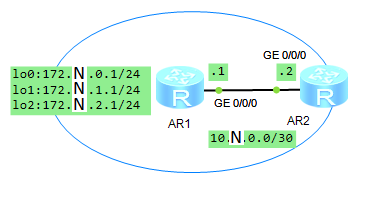
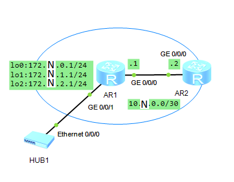

1. Собираем топологию по рисунку:

   

2. Назначаем IP-адреса интерфейсам маршрутизаторов:

   ```
                        [Huawei] sysname LeftAR
                        [LeftAR] interface  GigabitEthernet 0/0/0
   [LeftAR-GigabitEthernet0/0/0] ip address 10.N.0.1 30
   ```

   ```
                         [Huawei] sysname RightAR
                        [RightAR] interface  GigabitEthernet 0/0/0
   [RightAR-GigabitEthernet0/0/0] ip address 10.N.0.2 30
   ```

3. Создаём петлевые интерфейсы на маршрутизаторе LeftAR и назначаем им IP-адреса:

   ```
             [LeftAR] interface  LoopBack 0
   [LeftAR-LoopBack0] ip address 172.N.0.1 24
   [LeftAR-LoopBack0] interface  LoopBack 1
   [LeftAR-LoopBack1] ip address 172.N.1.1 24
   [LeftAR-LoopBack1] interface  LoopBack 2
   [LeftAR-LoopBack2] ip address 172.N.2.1 24
   ```

4. Проверяем связность сети на участке между маршрутизаторами LeftAR и RightAR:

   ```
   <LeftAR> ping 10.N.0.2
   ```

   ```
   <RightAR> ping 10.N.0.1
   ```

5. Проверяем, что сети с петлевыми интерфейсами маршрутизатора LeftAR недоступны с RightAR:

   ```
   <RightAR> ping 172.N.0.1
   <RightAR> ping 172.N.1.1
   <RightAR> ping 172.N.2.1
   ```

6. Настраиваем OSPF-маршрутизацию между маршрутизаторами LeftAR и RightAR.

   На LeftAR:

   - Включаем процесс OSPF-маршрутизации с номером 1 и присваиваем LeftAR идентификатор 1.1.1.1:

     ```
     [LeftAR] ospf 1 router-id 1.1.1.1
     ```
   
   - Добавляем сети в область 0 (обязательно использовать обратную маску!):

     ```
                  [LeftAR-ospf-1] area 0
     [LeftAR-ospf-1-area-0.0.0.0] network 10.N.0.0  0.0.0.3
     [LeftAR-ospf-1-area-0.0.0.0] network 172.N.0.0 0.0.0.255
     [LeftAR-ospf-1-area-0.0.0.0] network 172.N.1.0 0.0.0.255
     [LeftAR-ospf-1-area-0.0.0.0] network 172.N.2.0 0.0.0.255
     ```

   На RightAR:

   - Включаем процесс OSPF-маршрутизации с номером 1 и присваиваем RightAR идентификатор 2.2.2.2:

     ```
     [RightAR] ospf 1 router-id 2.2.2.2
     ```
   
   - Добавляем сети в область 0 (обязательно использовать обратную маску!):

     ```
                  [RightAR-ospf-1] area 0
     [RightAR-ospf-1-area-0.0.0.0] network 10.N.0.0 0.0.0.3
     ```

     На каждом из маршрутизаторов, если получено сообщение о необходимости перезапустить OSPF-процесс, перезапускаем его (я такого сообщения не получал, поэтому не знаю, как оно выглядит; не путать с сообщением об изменении статуса соседа):

     ```
     <LeftAR> reset ospf 1 process
     ```

     ```
     <RightAR> reset ospf 1 process
     ```

7. Просматриваем таблицу маршрутизации RightAR и проверяем, что в ней присутствуют маршруты до всех сетей:

   ```
   <RightAR> display ip routing-table
   ```

   В таблице указаны маршруты до петлевых интерфейсов, но не до самих сетей.

8. Добавляем к сети хаб, присоединив его к интерфейсу GE 0/0/1 LeftAR по рисунку:

   

   Назначаем IP-адрес интерфейсу GE 0/0/1 LeftAR и добавляем сеть, в которой он находится, в область 0 OSPF-процесса 1:

   ```
                        [LeftAR] interface  GigabitEthernet 0/0/1
   [LeftAR-GigabitEthernet0/0/1] ip address 172.N.3.1 24
   [LeftAR-GigabitEthernet0/0/1] ospf 1
                 [LeftAR-ospf-1] area 0
    [LeftAR-ospf-1-area-0.0.0.0] network 172.N.3.0 0.0.0.255
   ```

9. Просматриваем таблицу маршрутизации RightAR:

   ```
   <RightAR> display ip routing-table
   ```

   В таблице указан маршрут именно до новой сети, а не только до интерфейса маршрутизатора в ней. Метрика маршрута равна 2, а не 1, как у петлевых интерфейсов.

10. Проверяем полную связность сети:

    ```
    <RightAR> ping 172.N.0.1
    <RightAR> ping 172.N.1.1
    <RightAR> ping 172.N.2.1
    <RightAR> ping 172.N.3.1
    <RightAR> ping 10.N.0.1
    ```

    ```
    <LeftAR> ping 10.N.0.2
    ```

11. Просматриваем состояние OSPF:

    ```
    <RightAR> display ospf brief
    ```

    ```
    <LeftAR> display ospf brief
    <LeftAR> display ospf peer
    <LeftAR> display ospf interface
    <LeftAR> display ospf routing
    <LeftAR> display ospf lsdb
    ```

    - Для петлевых интерфейсов маршрутизатора LeftAR типы сетей — P2P, для остальных — Broadcast. При этом указаны следующие состояния:
      - GE 0/0/0 — backup designated router
      - GE 0/0/1 — designated router
      - Петлевые интерфейсы — P-2-P
