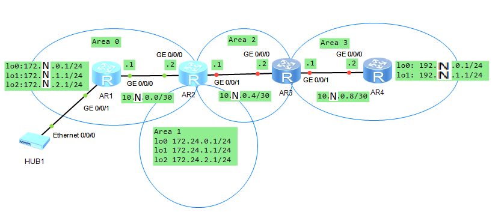

1. Достраиваем топологию из [предыдущей части](../Lab_07_1/Lab_07_1.md) лабораторной работы по рисунку:

   

2. Создаём петлевые интерфейсы на маршрутизаторе AR2 и назначаем им IP-адреса:

   ```
         [RightAR] sysname AR2
             [AR2] interface  LoopBack 0
   [AR2-LoopBack0] ip address 172.24.0.1 24
   [AR2-LoopBack0] interface  LoopBack 1
   [AR2-LoopBack1] ip address 172.24.1.1 24
   [AR2-LoopBack1] interface  LoopBack 2
   [AR2-LoopBack2] ip address 172.24.2.1 24
   ```

3. Добавляем сети, в которых находятся созданные петлевые интерфейсы, в область 1 OSPF-процесса 1:

   ```
                       [AR2] ospf 1
                [AR2-ospf-1] area 1
   [AR2-ospf-1-area-0.0.0.1] network 172.24.0.0 0.0.0.255
   [AR2-ospf-1-area-0.0.0.1] network 172.24.1.0 0.0.0.255
   [AR2-ospf-1-area-0.0.0.1] network 172.24.2.0 0.0.0.255
   ```

4. Проверяем, что в таблице маршрутизации AR1 есть информация о маршрутах до созданных на AR2 петлевых интерфейсов:

   ```
   [LeftAR] sysname AR1
      [AR1] display ip routing-table
   ```

5. Назначаем IP-адреса интерфейсам маршрутизатора AR3, включаем OSPF-процесс 1 и присваиваем AR3 идентификатор 3.3.3.3:

   ```
                     [Huawei] sysname AR3
                        [AR3] interface  GigabitEthernet 0/0/0
   [AR3-GigabitEthernet0/0/0] ip address 10.N.0.6 30
   [AR3-GigabitEthernet0/0/0] interface  GigabitEthernet 0/0/1
   [AR3-GigabitEthernet0/0/1] ip address 10.N.0.9 30
   [AR3-GigabitEthernet0/0/1] ospf 1 router-id 3.3.3.3
   ```

   Назначаем IP-адрес интерфейсу GE 0/0/1 AR2:

   ```
                        [AR2] interface  GigabitEthernet 0/0/1
   [AR2-GigabitEthernet0/0/1] ip address 10.N.0.5 30
   ```

6. Добавляем сеть 10.N.0.4/30 к области 2 OSPF-процесса 1 на маршрутизаторах AR2 и AR3:

   ```
                       [AR2] ospf 1
                [AR2-ospf-1] area 2
   [AR2-ospf-1-area-0.0.0.2] network 10.N.0.4 0.0.0.3
   ```

   ```
                       [AR3] ospf 1
                [AR3-ospf-1] area 2
   [AR3-ospf-1-area-0.0.0.2] network 10.N.0.4 0.0.0.3
   ```

7. Проверяем, что в таблице маршрутизации AR1 есть информация о маршруте до сети 10.N.0.4/30:

   ```
   <AR1> display ip routing-table
   ```

8. Просматриваем таблицы маршрутизации AR1, AR2 и AR3:

   ```
   <AR1> display ip routing-table
   ```

   ```
   <AR2> display ip routing-table
   ```

   ```
   <AR3> display ip routing-table
   ```

   Просматриваем таблицу маршрутизации OSPF:

   ```
   <AR1> display ospf routing
   ```

   - Для AR1 маршруты до сети 10.N.0.4/30 и петлевых интерфейсов маршрутизатора AR2 являются межобластными.

   ```
   <AR2> display ospf routing
   ```

   ```
   <AR3> display ospf routing
   ```

   - Для AR3 все маршруты, кроме маршрута до сети 10.N.0.4/30, являются межобластными.

9. Объявляем область 2 тупиковой для маршрутизаторов AR2 и AR3:

   ```
                       [AR2] ospf 1
                [AR2-ospf-1] area 2
   [AR2-ospf-1-area-0.0.0.2] stub
   ```

   ```
                       [AR3] ospf 1
                [AR3-ospf-1] area 2
   [AR3-ospf-1-area-0.0.0.2] stub
   ```

10. Просматриваем таблицы маршрутизации AR1, AR2 и AR3:

    ```
    <AR1> display ip routing-table
    ```

    - В таблице маршрутизации AR1 маршруты до сети 10.N.0.4/30 сохранились.

    ```
    <AR2> display ip routing-table
    ```

    ```
    <AR3> display ip routing-table
    ```

    - Из таблицы маршрутизации AR3 удалены маршруты до сетей «за» тупиковой областью: 10.N.0.0/30 и петлевых интерфейсов.

11. Объявляем область 2 полностью тупиковой для маршрутизаторов AR2 и AR3:

    ```
                        [AR2] ospf 1
                 [AR2-ospf-1] area 2
    [AR2-ospf-1-area-0.0.0.2] stub no-summary
    ```

    ```
                        [AR3] ospf 1
                 [AR3-ospf-1] area 2
    [AR3-ospf-1-area-0.0.0.2] stub no-summary
    ```

12. Просматриваем таблицы маршрутизации AR1, AR2 и AR3:

    ```
    <AR1> display ip routing-table
    ```

    ```
    <AR2> display ip routing-table
    ```

    ```
    <AR3> display ip routing-table
    ```

    - В таблицу маршрутизации AR3 добавлен маршрут по умолчанию через маршрутизатор AR2.

13. Сравним содержимое таблиц маршрутизации AR1, AR2 и AR3 для разных настроек области 2:

    | Область                      | AR1                   | AR2                   | AR3                                                                                                                                                             |
    |------------------------------|-----------------------|-----------------------|-----------------------------------------------------------------------------------------------------------------------------------------------------------------|
    | **Обычная**                  | Исходная <br/>таблица | Исходная <br/>таблица | Исходная <br/>таблица                                                                                                                                           |
    | **Тупиковая**                | Не изменилась         | Не изменилась         | Удалены маршруты до: <br/>10.N.0.0/30<br/>172.N.0.1/32<br/>172.N.1.1/32<br/>172.N.2.1/32<br/>172.N.3.0/24<br/>172.24.0.1/32<br/>172.24.1.1/32<br/>172.24.2.1/32 |
    | **Полностью <br/>тупиковая** | Не изменилась         | Не изменилась         | Добавлен маршрут по умолчанию через 10.N.0.5                                                                                                                    |

14. Отменяем изменения области 2 на маршрутизаторах AR2 и AR3:

    ```
                        [AR2] ospf 1
                 [AR2-ospf-1] area 2
    [AR2-ospf-1-area-0.0.0.2] undo stub
    ```

    ```
                        [AR3] ospf 1
                 [AR3-ospf-1] area 2
    [AR3-ospf-1-area-0.0.0.2] undo stub
    ```

    Просматриваем таблицу маршрутизации OSPF на AR2:

    ```
    <AR2> display ospf routing
    ```

15. Настраиваем виртуальный канал между маршрутизаторами AR2 и AR3:

    ```
                        [AR2] ospf 1
                 [AR2-ospf-1] area 2
    [AR2-ospf-1-area-0.0.0.2] vlink-peer 3.3.3.3
    ```

    ```
                        [AR3] ospf 1
                 [AR3-ospf-1] area 2
    [AR3-ospf-1-area-0.0.0.2] vlink-peer 2.2.2.2
    ```

16. Просматриваем таблицу маршрутизации OSPF на AR2:

    ```
    <AR2> display ospf routing
    ```

17. Назначаем IP-адреса интерфейсам маршрутизатора AR4, включаем OSPF-процесс 1 и присваиваем AR4 идентификатор 4.4.4.4:

    ```
                      [Huawei] sysname AR4
                         [AR4] interface  GigabitEthernet 0/0/0
    [AR4-GigabitEthernet0/0/0] ip address 10.N.0.10 30
    [AR4-GigabitEthernet0/0/0] interface  LoopBack 0
               [AR4-LoopBack0] ip address 192.N.0.1 24
               [AR4-LoopBack0] interface  LoopBack 1
               [AR4-LoopBack1] ip address 192.N.1.1 24
               [AR4-LoopBack1] ospf 1 router-id 4.4.4.4
    ```

18. Добавляем сети 10.N.0.8/30, 192.N.0.0/24 и 192.N.1.0/24 к области 3 OSPF-процесса 1 на маршрутизаторах AR3 и AR4:

    ```
                        [AR3] ospf 1
                 [AR3-ospf-1] area 3
    [AR3-ospf-1-area-0.0.0.3] network 10.N.0.8 0.0.0.3
    [AR3-ospf-1-area-0.0.0.3] network 192.N.0.0 0.0.0.255
    [AR3-ospf-1-area-0.0.0.3] network 192.N.1.0 0.0.0.255
    ```

    ```
                        [AR4] ospf 1
                 [AR4-ospf-1] area 3
    [AR4-ospf-1-area-0.0.0.3] network 10.N.0.8 0.0.0.3
    [AR4-ospf-1-area-0.0.0.3] network 192.N.0.0 0.0.0.255
    [AR4-ospf-1-area-0.0.0.3] network 192.N.1.0 0.0.0.255
    ```

19. Проверяем, что сети 10.N.0.8/30, 192.N.0.0/24 и 192.N.1.0/24 появились в таблицах маршрутизации AR1 и AR2:

    ```
    <AR1> display ip routing-table
    ```

    ```
    <AR2> display ip routing-table
    ```

20. Удаляем сети 10.N.0.8/30, 192.N.0.0/24 и 192.N.1.0/24 из области 3 OSPF-процесса 1 на маршрутизаторах AR3 и AR4:

    ```
                        [AR3] ospf 1
                 [AR3-ospf-1] area 3
    [AR3-ospf-1-area-0.0.0.3] undo network 10.N.0.8 0.0.0.3
    [AR3-ospf-1-area-0.0.0.3] undo network 192.N.0.0 0.0.0.255
    [AR3-ospf-1-area-0.0.0.3] undo network 192.N.1.0 0.0.0.255
    ```

    ```
                        [AR4] ospf 1
                 [AR4-ospf-1] area 3
    [AR4-ospf-1-area-0.0.0.3] undo network 10.N.0.8 0.0.0.3
    [AR4-ospf-1-area-0.0.0.3] undo network 192.N.0.0 0.0.0.255
    [AR4-ospf-1-area-0.0.0.3] undo network 192.N.1.0 0.0.0.255
    ```

21. Добавляем сети 10.N.0.8/30, 192.N.0.0/24 и 192.N.1.0/24 к области 0 OSPF-процесса 1 на маршрутизаторах AR3 и AR4:

    ```
                        [AR3] ospf 1
                 [AR3-ospf-1] area 0
    [AR3-ospf-1-area-0.0.0.0] network 10.N.0.8 0.0.0.3
    [AR3-ospf-1-area-0.0.0.0] network 192.N.0.0 0.0.0.255
    [AR3-ospf-1-area-0.0.0.0] network 192.N.1.0 0.0.0.255
    ```

    ```
                        [AR4] ospf 1
                 [AR4-ospf-1] area 0
    [AR4-ospf-1-area-0.0.0.0] network 10.N.0.8 0.0.0.3
    [AR4-ospf-1-area-0.0.0.0] network 192.N.0.0 0.0.0.255
    [AR4-ospf-1-area-0.0.0.0] network 192.N.1.0 0.0.0.255
    ```
