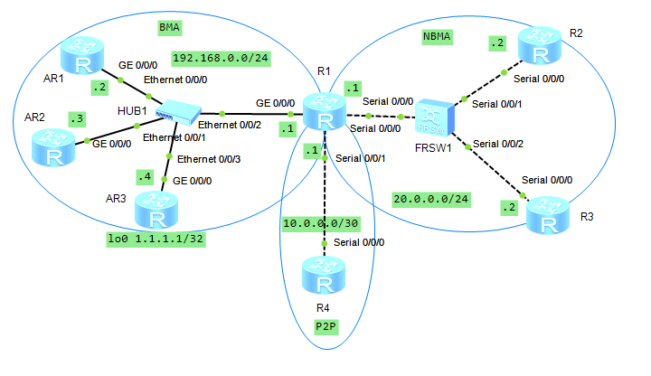
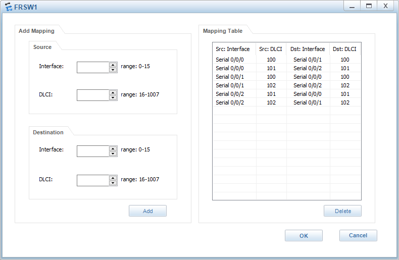

1. Собираем топологию по рисунку:

   

   В качестве маршрутизаторов AR1–AR3 используем модель AR1220, в качестве R1–R4 — Router (без номера модели).

2. Назначаем IP-адреса интерфейсам маршрутизаторов в BMA-сети:

   ```
                         [Huawei] sysname LeftAR1
                        [LeftAR1] interface  GigabitEthernet 0/0/0
   [LeftAR1-GigabitEthernet0/0/0] ip address 192.168.N.2 24
   ```

   ```
                         [Huawei] sysname LeftAR2
                        [LeftAR2] interface  GigabitEthernet 0/0/0
   [LeftAR2-GigabitEthernet0/0/0] ip address 192.168.N.3 24
   ```

   ```
                         [Huawei] sysname LeftAR3
                        [LeftAR3] interface  GigabitEthernet 0/0/0
   [LeftAR3-GigabitEthernet0/0/0] ip address 192.168.N.4 24
   [LeftAR3-GigabitEthernet0/0/0] interface  LoopBack 0
              [LeftAR3-LoopBack0] ip address 1.1.1.1 32
   ```

   ```
                         [Huawei] sysname MiddleR
                        [MiddleR] interface  GigabitEthernet 0/0/0
   [MiddleR-GigabitEthernet0/0/0] ip address 192.168.N.1 24
   ```

   Настраиваем OSPF-маршрутизацию на LeftAR1, LeftAR2, LeftAR3 и MiddleR в области 0:

   ```
                       [MiddleR] ospf 1
                [MiddleR-ospf-1] area 0
   [MiddleR-ospf-1-area-0.0.0.0] network 192.168.N.0 0.0.0.255
   ```

   ```
                       [LeftAR1] ospf 1
                [LeftAR1-ospf-1] area 0
   [LeftAR1-ospf-1-area-0.0.0.0] network 192.168.N.0 0.0.0.255
   ```

   ```
                       [LeftAR2] ospf 1
                [LeftAR2-ospf-1] area 0
   [LeftAR2-ospf-1-area-0.0.0.0] network 192.168.N.0 0.0.0.255
   ```

   ```
                       [LeftAR3] ospf 1
                [LeftAR3-ospf-1] area 0
   [LeftAR3-ospf-1-area-0.0.0.0] network 192.168.N.0 0.0.0.255
   [LeftAR3-ospf-1-area-0.0.0.0] network 1.1.1.1 255.255.255.255
   ```


3. Просматриваем состояние OSPF:

   ```
   <LeftAR1> display ospf interface
   ```

   ```
   <LeftAR2> display ospf interface
   ```

   ```
   <LeftAR3> display ospf interface
   ```

   ```
   <MiddleR> display ospf interface
   ```

   - Идентификаторы маршрутизаторов в OSPF совпадают с их IP-адресами в сети 192.168.N.0/24.  
     Такое поведение предусмотрено протоколом OSPF, если идентификаторы маршрутизаторов не заданы вручную.
   - У всех пар соседей тип соседства broadcast.

4. Перезагружаем хаб и ждём окончания работы OSPF. Просматриваем состояние OSPF:

   ```
   <LeftAR1> display ospf interface
   ```

   ```
   <LeftAR2> display ospf interface
   ```

   ```
   <LeftAR3> display ospf interface
   ```

   ```
   <MiddleR> display ospf interface
   ```

   - LeftAR3 стал DR, как маршрутизатор с наибольшим идентификатором.
   - LeftAR2 стал BDR, как маршрутизатор с наибольшим идентификатором после LeftAR3.

5. На интерфейсе GE 0/0/0 MiddleR задаём приоритет в OSPF:

   ```
                        [MiddleR] interface GigabitEthernet 0/0/0
   [MiddleR-GigabitEthernet0/0/0] ospf dr-priority 100
   ```

6. Перезагружаем хаб и ждём окончания работы OSPF. Просматриваем состояние OSPF:

   ```
   <LeftAR1> display ospf interface
   ```

   ```
   <LeftAR2> display ospf interface
   ```

   ```
   <LeftAR3> display ospf interface
   ```

   ```
   <MiddleR> display ospf interface
   ```

   - MiddleR стал DR, как маршрутизатор с наибольшим приоритетом.
   - LeftAR3 стал BDR, как маршрутизатор с наибольшим идентификатором.
   - Если ничего не изменилось, значит, нужно выключить хаб на большее время.

7. Задаём идентификатор маршрутизатора LeftAR1 в OSPF и перегружаем OSPF-процесс 1:

   ```
   [LeftAR1] router id [200+N].[200+N].[200+N].[200+N]
   [LeftAR1] quit
   <LeftAR1> reset ospf 1 process
             y
   ```

8. Просматриваем OSPF-соседей маршрутизатора LeftAR1:

   ```
   <LeftAR1> display ospf peer
   ```

   - Идентификаторы OSPF-соседей остались теми же.

   Просматриваем состояние OSPF:

   ```
   <LeftAR1> display ospf interface
   ```

   - DR и BDR остались теми же.  
     Так как в OSPF DR и BDR переназначаются только в случае недоступности тех маршрутизаторов, которые отвечают за эти роли. Перезагрузка OSPF-процесса не сделала MiddleR или LeftAR3 недоступными.

9. Перезагружаем хаб и ждём окончания работы OSPF. Просматриваем состояние OSPF:

   ```
   <LeftAR1> display ospf interface
   ```

   ```
   <LeftAR2> display ospf interface
   ```

   ```
   <LeftAR3> display ospf interface
   ```

   ```
   <MiddleR> display ospf interface
   ```

   - MiddleR остался DR, как маршрутизатор с наибольшим приоритетом.
   - LeftAR1 стал BDR, как маршрутизатор с наибольшим идентификатором.

10. Настраиваем P2P-сеть между маршрутизаторами MiddleR и BottomR:

    ```
                        [MiddleR] interface  Serial 0/0/1
            [MiddleR-Serial0/0/1] ip address 10.0.0.1 30
            [MiddleR-Serial0/0/1] ospf 1
                 [MiddleR-ospf-1] area 1
    [MiddleR-ospf-1-area-0.0.0.1] network 10.0.0.0 0.0.0.3
    ```

    ```
                         [Huawei] sysname BottomR
                        [BottomR] interface  Serial 0/0/0
            [BottomR-Serial0/0/0] ip address 10.0.0.2 30
            [BottomR-Serial0/0/0] ospf 1
                 [BottomR-ospf-1] area 1
    [BottomR-ospf-1-area-0.0.0.1] network 10.0.0.0 0.0.0.3
    ```

11. Проверяем, что в таблицах маршрутизации LeftAR1, LeftAR2 и LeftAR3 есть маршрут до сети 10.0.0.0/30:

    ```
    <LeftAR1> display ip routing-table
    ```

    ```
    <LeftAR2> display ip routing-table
    ```

    ```
    <LeftAR3> display ip routing-table
    ```

12. На маршрутизаторах MiddleR и BottomR просматриваем состояние OSPF:

    ```
    <MiddleR> display ospf interface
    ```

    ```
    <BottomR> display ospf interface
    ```

    - Тип соседства: P-2-P
    - DR и BDR не выбирались.

13. Настраиваем сеть Frame Relay:

    ```
                            [MiddleR] interface  Serial 0/0/0
                [MiddleR-Serial0/0/0] ip address 20.0.N.1 24
                [MiddleR-Serial0/0/0] link-protocol fr
                                      y
                [MiddleR-Serial0/0/0] fr dlci 100
    [MiddleR-fr-dlci-Serial0/0/0-100] fr dlci 101
    ```

    ```
                             [Huawei] sysname RightR1
                            [RightR1] interface  Serial 0/0/0
                [RightR1-Serial0/0/0] ip address 20.0.N.2 24
                [RightR1-Serial0/0/0] link-protocol fr
                                      y
                [RightR1-Serial0/0/0] fr dlci 100
    [RightR1-fr-dlci-Serial0/0/0-100] fr dlci 102
    ```

    ```
                             [Huawei] sysname RightR2
                            [RightR2] interface  Serial 0/0/0
                [RightR2-Serial0/0/0] ip address 20.0.N.3 24
                [RightR2-Serial0/0/0] link-protocol fr
                                      y
                [RightR2-Serial0/0/0] fr dlci 101
    [RightR2-fr-dlci-Serial0/0/0-101] fr dlci 102
    ```

    Запускаем Wireshark на интерфейсе Serial 0/0/0 MiddleR (заранее, чтобы поймать пакеты INARP), выбрав link layer type FR, и настраиваем FR-коммутатор по рисунку:

    

    | Src: Interface | Src: DLCI | Dst: Interface | Dst: DLCI |
    |----------------|:---------:|----------------|:---------:|
    | Serial 0/0/0   |    100    | Serial 0/0/1   |    100    |
    | Serial 0/0/0   |    101    | Serial 0/0/2   |    101    |
    | Serial 0/0/1   |    100    | Serial 0/0/0   |    100    |
    | Serial 0/0/1   |    102    | Serial 0/0/2   |    102    |
    | Serial 0/0/2   |    101    | Serial 0/0/0   |    101    |
    | Serial 0/0/2   |    102    | Serial 0/0/1   |    102    |

14. Проверяем связность FR-сети:

    ```
    <MiddleR> ping 20.0.N.2
    <MiddleR> ping 20.0.N.3
    ```

    Просматриваем состояние FR-сети:

    ```
    <MiddleR> display fr inarp-info
    <MiddleR> display fr map-info
    <MiddleR> display fr pvc-info
    ```

15. Настраиваем OSPF-маршрутизацию на MiddleR, RightR1 и RightR2 в области 2:

    ```
                        [MiddleR] ospf 1
                 [MiddleR-ospf-1] area 2
    [MiddleR-ospf-1-area-0.0.0.2] network 20.0.N.0 0.0.0.255
    ```

    ```
                        [RightR1] ospf 1
                 [RightR1-ospf-1] area 2
    [RightR1-ospf-1-area-0.0.0.2] network 20.0.N.0 0.0.0.255
    ```

    ```
                        [RightR2] ospf 1
                 [RightR2-ospf-1] area 2
    [RightR2-ospf-1-area-0.0.0.2] network 20.0.N.0 0.0.0.255
    ```

    Просматриваем OSPF-соседей маршрутизатора RightR1:

    ```
    <RightR1> display ospf peer
    ```

    - OSPF-соседи отсутствует, то есть соседство не установлено.

16. Настраиваем OSPF-соседство на маршрутизаторах MiddleR, RightR1 и RightR2:

    ```
           [MiddleR] ospf 1
    [MiddleR-ospf-1] peer 20.0.N.2
    [MiddleR-ospf-1] peer 20.0.N.3
    ```

    ```
           [RightR1] ospf 1
    [RightR1-ospf-1] peer 20.0.N.1
    [RightR1-ospf-1] peer 20.0.N.3
    ```

    ```
           [RightR2] ospf 1
    [RightR2-ospf-1] peer 20.0.N.1
    [RightR2-ospf-1] peer 20.0.N.2
    ```

17. Просматриваем OSPF-соседей маршрутизатора RightR2:

    ```
    <RightR2> display ospf peer
    ```

    - Соседство установлено.

    Просматриваем состояние OSPF:

    ```
    <RightR2> display ospf interface
    ```

    - Соседство типа NBMA.
    - DR и BDR выбраны.
    - В NBMA-сетях отсутствуют широковещательные запросы, поэтому маршрутизаторы не смогли автоматически установить OSPF-соседство. Из-за этого необходимо было настроить его вручную.
