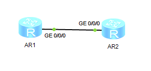

1. Собираем топологию по рисунку:

   

2. Назначаем IPv6-адреса интерфейсам маршрутизаторов (N дополяем нулём слева до двух цифр):

   ```
                        [Huawei] sysname LeftAR
                        [LeftAR] ipv6
                        [LeftAR] interface GigabitEthernet 0/0/0
   [LeftAR-GigabitEthernet0/0/0] ipv6 enable
   [LeftAR-GigabitEthernet0/0/0] ipv6 address 3[N]0::1/64
   ```

   ```
                         [Huawei] sysname RightAR
                        [RightAR] ipv6
                        [RightAR] interface GigabitEthernet 0/0/0
   [RightAR-GigabitEthernet0/0/0] ipv6 enable
   [RightAR-GigabitEthernet0/0/0] ipv6 address 3[N]0::2/64
   ```

3. Проверяем связность сети:

   ```
   <LeftAR> ping ipv6 3[N]0::2
   ```

4. Создаём петлевые интерфейсы на маршрутизаторе LeftAR и назначаем им IPv6-адреса:

   ```
             [LeftAR] interface LoopBack 1
   [LeftAR-LoopBack1] ipv6 enable
   [LeftAR-LoopBack1] ipv6 address 3[N]1::1/64
   [LeftAR-LoopBack1] interface LoopBack 2
   [LeftAR-LoopBack2] ipv6 enable
   [LeftAR-LoopBack2] ipv6 address 3[N]2::1/64
   ```

5. Создаём петлевые интерфейсы на маршрутизаторе RightAR и назначаем им IPv6-адреса:

   ```
             [RightAR] interface LoopBack 1
   [RightAR-LoopBack1] ipv6 enable
   [RightAR-LoopBack1] ipv6 address 3[N]3::1/64
   [RightAR-LoopBack1] interface LoopBack 2
   [RightAR-LoopBack2] ipv6 enable
   [RightAR-LoopBack2] ipv6 address 3[N]4::1/64
   ```

6. Проверяем, что у каждого из маршрутизаторов в таблице маршрутизации есть маршруты до всех сетей, в которых располагаются интерфейсы этого маршрутизатора:

   ```
   <LeftAR> display ipv6 routing-table
             
   ```

   ```
   <RightAR> display ipv6 routing-table
              
   ```

7. На маршрутизаторе LeftAR настраиваем OSPFv3-маршрутизацию:

   ```
                        [LeftAR] ospfv3 1
               [LeftAR-ospfv3-1] router-id 1.1.1.1
               [LeftAR-ospfv3-1] interface GigabitEthernet 0/0/0
   [LeftAR-GigabitEthernet0/0/0] ospfv3 1 area 0
   [LeftAR-GigabitEthernet0/0/0] interface LoopBack 1
              [LeftAR-LoopBack1] ospfv3 1 area 0
              [LeftAR-LoopBack1] interface LoopBack 2
              [LeftAR-LoopBack2] ospfv3 1 area 0
   ```

8. На маршрутизаторе RightAR настраиваем OSPFv3-маршрутизацию:

   ```
                        [RightAR] ospfv3 1
               [RightAR-ospfv3-1] router-id 2.2.2.2
               [RightAR-ospfv3-1] interface GigabitEthernet 0/0/0
   [RightAR-GigabitEthernet0/0/0] ospfv3 1 area 0
   [RightAR-GigabitEthernet0/0/0] interface LoopBack 1
              [RightAR-LoopBack1] ospfv3 1 area 0
              [RightAR-LoopBack1] interface LoopBack 2
              [RightAR-LoopBack2] ospfv3 1 area 0
   ```

9. Проверяем, что в таблицах маршрутизации LeftAR и RightAR есть маршруты до всех сетей:

   ```
   <LeftAR> display ipv6 routing-table
              
   ```

   ```
   <RightAR> display ipv6 routing-table
               
   ```

10. Просматриваем состояние OSPFv3 на маршрутизаторе LeftAR:

    ```
    <LeftAR> display ipv6 routing-table protocol ospfv3
              
    ```

    - Сети 3[N]0::/64, 3[N]1::/64, 3[N]2::/64 помечены неактивными, так как LeftAR присоединён к ним непосредственно, поэтому он не использует информацию о маршрутах к этим сетям, полученную через OSPFv3.
    
    Просматриваем остальную информацию о OSPFv3:

    ```
    <LeftAR> display ospfv3 interface
              
    <LeftAR> display ospfv3 topology
    <LeftAR> display ospfv3 peer
    <LeftAR> display ospfv3 next-hop
    ```
