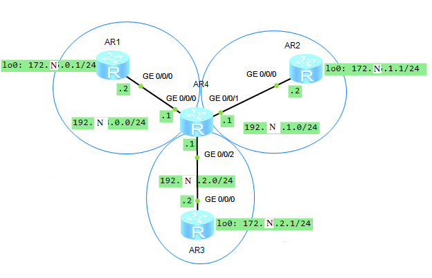

1. Собираем топологию по рисунку:

   

   - Для MiddleAR используем маршрутизатор AR2220, для остальных — AR1220.

2. Назначаем IP-адреса интерфейсам маршрутизаторов:

   ```
                          [Huawei] sysname MiddleAR
                        [MiddleAR] interface  GigabitEthernet 0/0/0
   [MiddleAR-GigabitEthernet0/0/0] ip address 192.N.0.1 24
   [MiddleAR-GigabitEthernet0/0/0] interface  GigabitEthernet 0/0/1
   [MiddleAR-GigabitEthernet0/0/1] ip address 192.N.1.1 24
   [MiddleAR-GigabitEthernet0/0/1] interface  GigabitEthernet 0/0/2
   [MiddleAR-GigabitEthernet0/0/2] ip address 192.N.2.1 24
   ```

   ```
                        [Huawei] sysname LeftAR
                        [LeftAR] interface  GigabitEthernet 0/0/0
   [LeftAR-GigabitEthernet0/0/0] ip address 192.N.0.2 24
   [LeftAR-GigabitEthernet0/0/0] interface  LoopBack 0
              [LeftAR-LoopBack0] ip address 172.N.0.1 24
   ```

   ```
                         [Huawei] sysname RightAR
                        [RightAR] interface  GigabitEthernet 0/0/0
   [RightAR-GigabitEthernet0/0/0] ip address 192.N.1.2 24
   [RightAR-GigabitEthernet0/0/0] interface  LoopBack 0
              [RightAR-LoopBack0] ip address 172.N.1.1 24
   ```

   ```
                          [Huawei] sysname BottomAR
                        [BottomAR] interface  GigabitEthernet 0/0/0
   [BottomAR-GigabitEthernet0/0/0] ip address 192.N.2.2 24
   [BottomAR-GigabitEthernet0/0/0] interface  LoopBack 0
              [BottomAR-LoopBack0] ip address 172.N.2.1 24
   ```

3. Настраиваем RIPv2-маршрутизацию на LeftAR и MiddleAR:

   ```
         [LeftAR] rip 1
   [LeftAR-rip-1] version 2
   [LeftAR-rip-1] network 172.N.0.0
   [LeftAR-rip-1] network 192.N.0.0
   ```

   ```
         [MiddleAR] rip 1
   [MiddleAR-rip-1] version 2
   [MiddleAR-rip-1] network 192.N.0.0
   ```

4. Настраиваем OSPF-маршрутизацию на RightAR и MiddleAR в области 0:

   ```
                       [RightAR] ospf 1
                [RightAR-ospf-1] area 0
   [RightAR-ospf-1-area-0.0.0.0] network 172.N.1.0 0.0.0.255
   [RightAR-ospf-1-area-0.0.0.0] network 192.N.1.0 0.0.0.255
   ```

   ```
                       [MiddleAR] ospf 1
                [MiddleAR-ospf-1] area 0
   [MiddleAR-ospf-1-area-0.0.0.0] network 192.N.1.0 0.0.0.255
   ```

5. На BottomAR задаём маршрут по умолчанию через MiddleAR:

   ```
   [BottomAR] ip route-static 0.0.0.0 0 192.N.2.1
   ```

6. На MiddleAR задаём маршрут до сети 172.N.2.0/24 через BottomAR:

   ```
   [MiddleAR] ip route-static 172.N.2.0 24 192.N.2.2
   ```

7. Просматриваем таблицу маршрутизации MiddleAR и проверяем, что в ней есть информация о маршрутах до всех сетей:

   ```
   <MiddleAR> display ip routing-table
   ```

   - Для маршрутов к петлевым интерфейсам указаны следующие IP-адреса: 172.N.0.0/24, 172.N.1.1/32 и 172.N.2.0/24.  
     Для LoopBack 0 RightAR указан IP-адрес с маской 32, так как OSPF учитывает, что интерфейс петлевой и за ним нет реальной сети.
   - Маршруты к петлевым интерфейсам имеют более высокие preference и cost, так как петлевые интерфейсы не присоединены напрямую к MiddleAR.

8. Проверяем доступность всех петлевых интерфейсов с MiddleAR:

   ```
   <MiddleAR> ping 172.N.0.1
   <MiddleAR> ping 172.N.1.1
   <MiddleAR> ping 172.N.2.1
   ```

9. На MiddleAR настраиваем импорт OSPF- и статических маршрутов в RIP-процесс 1:

   ```
         [MiddleAR] rip 1
   [MiddleAR-rip-1] import-route ospf 1 cost 2
   [MiddleAR-rip-1] import-route static cost 2
   ```

10. Проверяем доступность сетей 172.N.1.0/24 и 172.N.2.0/24 с LeftAR:

    ```
    <LeftAR> ping 172.N.1.1
    <LeftAR> ping 172.N.2.1
    ```

   - Сеть 172.N.1.0/24 недоступна, так как:
     - в OSPF-процессе 1 нет информации о маршруте к сети 192.N.0.0/24;
     - из-за этого RightAR не знает маршрута до LeftAR, который имеет IP-адрес 192.N.0.2;
     - из-за этого RightAR, получив ICMP-запрос, не может отправить ответ.
   - Сеть 172.N.2.0/24 доступна, так как BottomAR шлёт ответ на MiddleAR по умолчанию, а тот имеет маршрут до LeftAR.

11. Проверяем доступность сетей 192.N.1.0/24 и 192.N.2.0/24 с LeftAR:

    ```
    <LeftAR> ping 192.N.1.1
    <LeftAR> ping 192.N.1.2
    <LeftAR> ping 192.N.2.1
    <LeftAR> ping 192.N.2.2
    ```

    - IP-адрес 192.N.1.1 доступен, так как сеть 192.N.1.0/24 анонсируется OSPF-процессом 1, маршруты из которого импортируются в RIP-процесс 1, настроенный на LeftAR.
    - IP-адрес 192.N.1.2 недоступен по тем же причинам, что и IP-адрес 172.N.1.1.
    - Сеть 192.N.2.0/24 полностью недоступна, так как она не анонсируется RIP- или OSPF-процессами и к ней не указан статический маршрут, который импортировался бы в RIP-процесс 1.

    Добавляем сеть 192.N.2.0/24 в RIP-процесс 1 на MiddleAR:

    ```
          [MiddleAR] rip 1
    [MiddleAR-rip-1] network 192.N.2.0
    ```

    Проверяем доступность сети 192.N.2.0/24 с LeftAR:

    ```
    <LeftAR> ping 192.N.2.1
    <LeftAR> ping 192.N.2.2
    ```

12. На MiddleAR настраиваем импорт RIP- и статических маршрутов в OSPF-процесс 1:

    ```
           [MiddleAR] ospf 1
    [MiddleAR-ospf-1] import-route rip 1 cost 10
    [MiddleAR-ospf-1] import-route static cost 10
    ```

13. Просматриваем таблицу маршрутизации RightAR и проверяем наличие импортированных маршрутов в ней:

    ```
    <RightAR> display ip routing-table
    ```

    - Импортированные маршруты имеют preference 150, cost 10 и тип протокола O_ASE.

14. Просматриваем таблицы маршрутизации LeftAR, RightAR и MiddleAR и проверяем в них наличие маршрутов до всех сетей:

    ```
    <LeftAR> display ip routing-table
    ```

    ```
    <RightAR> display ip routing-table
    ```

    ```
    <MiddleAR> display ip routing-table
    ```

    Проверяем доступность сетей 172.N.2.0/24 и 192.N.2.0/24 с LeftAR и RightAR:

    ```
    <LeftAR> ping 172.N.2.1
    <LeftAR> ping 192.N.2.2
    ```

    ```
    <RightAR> ping 172.N.2.1
    <RightAR> ping 192.N.2.2
    ```

    - Они доступны, так как BottomAR шлёт ответ на MiddleAR по умолчанию, а тот имеет маршрут до LeftAR и RightAR.
