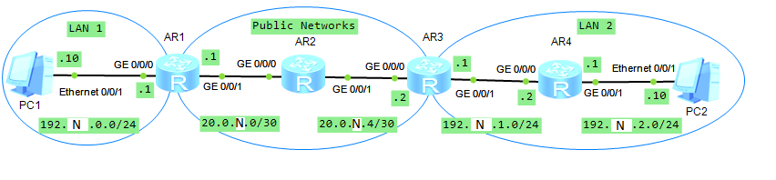

**Внимание!** В используемой в этом решении топологии расположение интерфейсов отличается от расположения на рисунке от Максютина.

1. Собираем топологию по рисунку:

   

2. Назначаем IP-адреса устройствам:

   ```
                        [Huawei] sysname LeftAR
                        [LeftAR] interface  GigabitEthernet 0/0/0
   [LeftAR-GigabitEthernet0/0/0] ip address 192.N.0.1 24
   [LeftAR-GigabitEthernet0/0/0] interface  GigabitEthernet 0/0/1
   [LeftAR-GigabitEthernet0/0/1] ip address 20.0.N.1 30
   ```

   ```
                          [Huawei] sysname MiddleAR
                        [MiddleAR] interface  GigabitEthernet 0/0/0
   [MiddleAR-GigabitEthernet0/0/0] ip address 20.0.N.2 30
   [MiddleAR-GigabitEthernet0/0/0] interface  GigabitEthernet 0/0/1
   [MiddleAR-GigabitEthernet0/0/1] ip address 20.0.N.5 30
   ```

   ```
                          [Huawei] sysname RightAR1
                        [RightAR1] interface  GigabitEthernet 0/0/0
   [RightAR1-GigabitEthernet0/0/0] ip address 192.N.1.1 24
   [RightAR1-GigabitEthernet0/0/0] interface  GigabitEthernet 0/0/1
   [RightAR1-GigabitEthernet0/0/1] ip address 20.0.N.6 30
   ```

   ```
                          [Huawei] sysname RightAR2
                        [RightAR2] interface  GigabitEthernet 0/0/0
   [RightAR2-GigabitEthernet0/0/0] ip address 192.N.2.1 24
   [RightAR2-GigabitEthernet0/0/0] interface  GigabitEthernet 0/0/1
   [RightAR2-GigabitEthernet0/0/1] ip address 192.N.1.2 24
   ```

   Узел LeftPC:

   - IP Address: 192.N.0.10
   - Subnet mask: 255.255.255.0
   - Gateway: 192.N.0.1

   Узел RightPC:

   - IP Address: 192.N.2.10
   - Subnet mask: 255.255.255.0
   - Gateway: 192.N.2.1

3. Настраиваем OSPF-маршрутизацию на LeftAR, MiddleAR и RightAR1 в области 0, включая только сети 20.0.N.0/30 и 20.0.N.4/30:

   ```
                       [LeftAR] ospf 1
                [LeftAR-ospf-1] area 0
   [LeftAR-ospf-1-area-0.0.0.0] network 20.0.N.0 0.0.0.3
   ```

   ```
                       [MiddleAR] ospf 1
                [MiddleAR-ospf-1] area 0
   [MiddleAR-ospf-1-area-0.0.0.0] network 20.0.N.0 0.0.0.3
   [MiddleAR-ospf-1-area-0.0.0.0] network 20.0.N.4 0.0.0.3
   ```

   ```
                       [RightAR1] ospf 1
                [RightAR1-ospf-1] area 0
   [RightAR1-ospf-1-area-0.0.0.0] network 20.0.N.4 0.0.0.3
   ```

4. Проверяем связность сети между LeftAR и RightAR1:

   ```
   <LeftAR> ping 20.0.N.6
   ```

5. Сохраняем текущее состояние топологии для 2-й части лабораторной работы.

6. Настраиваем GRE-туннель на маршрутизаторе LeftAR:

   ```
               [LeftAR] interface Tunnel 0/0/0
   [LeftAR-Tunnel0/0/0] tunnel-protocol gre
   [LeftAR-Tunnel0/0/0] source GigabitEthernet 0/0/1
   [LeftAR-Tunnel0/0/0] destination 20.0.N.6
   [LeftAR-Tunnel0/0/0] ip address 192.N.3.1 30
   ```

7. Просматриваем список интерфейсов LeftAR и его таблицу маршрутизации:

   ```
   <LeftAR> display ip interface brief
   <LeftAR> display ip routing-table
   ```

   - Туннель включён, хотя настройка на другом его конце ещё не производилась.
   - В таблице маршрутизации есть сеть 192.N.3.0/30.

8. Настраиваем GRE-туннель на маршрутизаторе LeftAR:

   ```
               [RightAR1] interface Tunnel 0/0/0
   [RightAR1-Tunnel0/0/0] tunnel-protocol gre
   [RightAR1-Tunnel0/0/0] source 20.0.N.6
   [RightAR1-Tunnel0/0/0] destination 20.0.N.1
   [RightAR1-Tunnel0/0/0] ip address 192.N.3.2 30
   ```

9. Запускаем Wireshark на интерфейсе GE 0/0/1 LeftAR, задаём фильтр поиска "icmp" и выполняем трассировку маршрута с RightAR1 до LeftAR:

   ```
   <RightAR1> tracert 20.0.N.1
   <RightAR1> tracert 192.N.3.1
   ```

   - В трассировке до IP-адреса 20.0.N.1 промежуточный маршрутизатор MiddleAR показан (с IP-адресом 20.0.N.5), а в трассировке до IP-адреса 192.N.3.1 — нет, показан только RightAR1.

10. Просматриваем пакеты, передаваемые с LeftAR на IP-адрес 192.N.3.2.

    - В каждом пакете содержится по два IP-заголовка: внешний адресует пакет от 20.0.N.1 к 20.0.N.6, внутренний — от 192.N.3.1 к 192.N.3.2.

11. Настраиваем OSPF-маршрутизацию на LeftAR, RightAR1 и RightAR2 в области 0 OSPF-процесса 2, включая только сети 192.N.0.0/24, 192.N.1.0/24, 192.N.2.0/24 и 192.N.3.0/30:

    ```
                        [LeftAR] ospf 2
                 [LeftAR-ospf-1] area 0
    [LeftAR-ospf-2-area-0.0.0.0] network 192.N.0.0 0.0.0.255
    [LeftAR-ospf-2-area-0.0.0.0] network 192.N.3.0 0.0.0.3
    ```

    ```
                        [RightAR1] ospf 2
                 [RightAR1-ospf-1] area 0
    [RightAR1-ospf-2-area-0.0.0.0] network 192.N.1.0 0.0.0.255
    [RightAR1-ospf-2-area-0.0.0.0] network 192.N.3.0 0.0.0.3
    ```

    ```
                        [RightAR2] ospf 2
                 [RightAR2-ospf-1] area 0
    [RightAR2-ospf-2-area-0.0.0.0] network 192.N.1.0 0.0.0.255
    [RightAR2-ospf-2-area-0.0.0.0] network 192.N.2.0 0.0.0.255
    ```

12. Просматриваем таблицы маршрутизации:

    ```
    <LeftAR> display ip routing-table
    ```

    ```
    <MiddleAR> display ip routing-table
    ```

    ```
    <RightAR1> display ip routing-table
    ```

    ```
    <RightAR2> display ip routing-table
    ```

    - В таблицах маршрутизации LeftAR, RightAR1 и RightAR2 есть каждая из сетей 192.N.0.0/24, 192.N.1.0/24, 192.N.2.0/24 и 192.N.3.0/30.
    - В таблице маршрутизации RightAR2 отсутствуют сети 20.0.N.0/30 и 20.0.N.4/30.
    - В таблице маршрутизации MiddleAR отсутствуют сети 192.N.0.0/24, 192.N.1.0/24, 192.N.2.0/24 и 192.N.3.0/30.

    Проверяем связность сети между узлами LeftPC и RightPC:

    ```
    LeftPC> ping 192.N.2.10
    ```

    Сохраняем текущее состояние топологии для 3-й части лабораторной работы.


13. Просматриваем таблицы маршрутизации LeftAR, RightAR1 и RightAR2:

    ```
    <LeftAR> display ip routing-table
    ```

    ```
    <RightAR1> display ip routing-table
    ```

    ```
    <RightAR2> display ip routing-table
    ```

    - Метрики сетей, доступных через туннель, равны 1563 либо 1564.

    Просматриваем состояние интерфесов Tunnel 0/0/0 LeftAR и Tunnel 0/0/0 RightAR1:

    ```
    <LeftAR> display ospf 2 interface Tunnel 0/0/0
    ```

    ```
    <RightAR1> display ospf 2 interface Tunnel 0/0/0
    ```

    - Метрика туннеля равна 1562.

    Задаём метрику маршрута через туннель на маршрутизаторах LeftAR и RightAR1:

    ```
                [LeftAR] interface Tunnel 0/0/0
    [LeftAR-Tunnel0/0/0] ospf cost 10
    ```

    ```
                [RightAR1] interface Tunnel 0/0/0
    [RightAR1-Tunnel0/0/0] ospf cost 10
    ```

    Просматриваем таблицы маршрутизации LeftAR, RightAR1 и RightAR2:

    ```
    <LeftAR> display ip routing-table
    ```

    ```
    <RightAR1> display ip routing-table
    ```

    ```
    <RightAR2> display ip routing-table
    ```

    - Метрики сетей, доступных через туннель, равны 11 либо 12.

14. Выполняем трассировку маршрута с LeftPC до RightPC:

    ```
    LeftPC> tracert 192.N.2.10
    ```

    - В трассировке 4 хопа:
      1. 192.N.0.1 (GE 0/0/0 LeftAR)
      2. 192.N.3.2 (Tunnel 0/0/0 RightAR1)
      3. 192.N.1.2 (GE 0/0/1 RightAR2)
      4. 192.N.2.10 (Ethernet 0/0/1 RightPC)
    - MiddleAR в трассировке отсутствует, потому что пакеты проходят через GRE-туннель.

15. Выполняем трассировку маршрута с LeftPC до RightAR1:

    ```
    LeftPC> tracert 20.0.N.6
    LeftPC> tracert 192.N.1.1
    ```

    - В трассировке до IP-адреса 20.0.N.6 3 хопа:
      1. 192.N.0.1 (GE 0/0/0 LeftAR)
      2. Неопределённый
      3. 20.0.N.6 (GE 0/0/1 RightAR1)
    - В трассировке до IP-адреса 192.N.1.1 2 хопа:
      1. 192.N.0.1 (GE 0/0/0 LeftAR)
      2. 192.N.1.1 (GE 0/0/0 RightAR1)
    - В трассировке до IP-адреса 192.N.1.1 на 1 хоп меньше, так как пакеты проходят через GRE-туннель. Использована инкапсуляция (в порядке от внешнего к внутреннему): Ethernet II, IPv4, GRE, IPv4, ICMP.
    - В трассировке до IP-адреса 20.0.N.6 адрес 2-го хопа не определён, потому что MiddleAR не знает маршрут до сети 192.N.0.0/24, в которой расположен отправитель LeftPC. Использована инкапсуляция (в порядке от внешнего к внутреннему): Ethernet II, IPv4, ICMP.

    Закрываем Wireshark.

16. Запускаем Wireshark на интерфейсе GE 0/0/1 MiddleAR, задаём фильтр поиска "ospf" и просматриваем пакеты, генерируемые OSPF-процессом 2.

    - В пакете два IP-заголовка, внешний из которых адресует пакет от 20.0.N.1 к 20.0.N.6, а внутренний — от 192.N.3.1 к 224.0.0.5.
    - Трафик не шифруется.

    Закрываем Wireshark.

17. На маршрутизаторе MiddleAR создаём ACL, запрещающий прохождение ICMP-пакетов:

    ```
                 [MiddleAR] acl 3000
    [MiddleAR-acl-adv-3000] rule deny icmp source any destination any
    ```

18. Назначаем созданный ACL интерфейсу GE 0/0/0 для входящего трафика.

    ```
                         [MiddleAR] interface GigabitEthernet 0/0/0
    [MiddleAR-GigabitEthernet0/0/0] traffic-filter inbound acl 3000
    ```

19. Проверяем связность сети между узлами LeftPC и RightPC и между маршрутизаторами LeftAR и RightAR1:

    ```
    LeftPC> ping 192.N.2.10
    ```

    ```
    <LeftAR> ping 20.0.N.6
    ```

    - ICMP-пакеты проходят между узлами LeftPC и RightPC, но не проходят между маршрутизаторами LeftAR и RightAR1, потому что ACL не проверяет содержимое пакета за GRE-заголовком.

20. На маршрутизаторе RightAR2 создаём ACL, запрещающий прохождение ICMP-пакетов:

    ```
                 [RightAR2] acl 3000
    [RightAR2-acl-adv-3000] rule deny icmp source any destination any
    ```

21. Назначаем созданный ACL интерфейсу GE 0/0/0 для исходящего трафика.

    ```
                         [RightAR2] interface GigabitEthernet 0/0/0
    [RightAR2-GigabitEthernet0/0/0] traffic-filter outbound acl 3000
    ```

    Проверяем связность сети между узлами LeftPC и RightPC:

    ```
    LeftPC> ping 192.N.2.10
    ```

    - ICMP-пакеты не проходят между LeftPC и RightPC.
